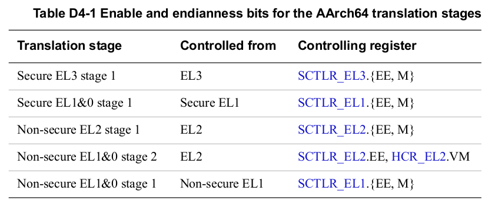
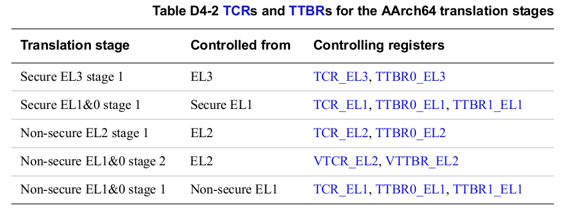

> ## D4.2.2 Controlling address translation stages

## D4.2.2 Address translation stages 配置

> [The implemented Exception levels and the resulting translation stages and regimes on page D4-1679](#) defines the translation regimes and stages. For each supported address translation stage:
* A system control register bit enables the stage of address translation.
* A system control register bit determines the endianness of the translation table lookups.
* A Translation Control Register (TCR) controls the stage of address translation.
* If a stage of address translation supports splitting the VA range into two subranges then that stage of translation provides a Translation Table Base Register (TTBR) for each VA subrange, and the stage of address translation has:
   - A single TCR.
   - A TTBR for each VA subrange.  
    Otherwise, a single TTBR holds the address of the translation table that must be used for the first lookup for the stage of address translation.

[The implemented Exception levels and the resulting translation stages and regimes on page D4-1679](#) 章节中定义了 translation regimes 和 stages。
对于每一个 address translation stage：
* 在 system control register 中，都有一个 bit 来使能该 address translation stage。
* 在 system control register 中，都有一个 bit 来配置 translation table lookups 的大小端
* 如果一个 address translation stage 支持两个 VA 区块，那么该 stage 会有以下的寄存器：
    - 一个 TCR
    - 两个 TTBR，分别用于配置两个 VA 区块的 translation table base。  
    TTBR 保存着 address translation stage 中的第一个 lookup 的 translation table 的基地址。

> For address translation stages controlled from AArch64:
* Table D4-1 shows the endianness bit and the enable bit for each stage of address translation. Each register entry in the table gives the endianness bit followed by the enable bit. Except for the Non-secure EL1&0 stage 2 translation, these two bits are in the same register.  
    
    > **NOTE:**  
    If the PA of the software that enables or disables a particular stage of address translation differs from its VA, speculative instruction fetching can cause complications. ARM strongly recommends that the PA and VA of any software that enables or disables a stage of address translation are identical if that stage of translation controls translations that apply to the software currently being executed.

> * Table D4-2 shows the TCR and TTBR, or TTBRs, for each stage of address translation. In the table, each Controlling registers entry gives the TCR followed by the TTBR or TTBRs.  
    

在 AArch64 运行态时，address translation stages 有以下的一些配置项：
* Table D4-1 中描述了各个 address translation stage 的 endianness 和 MMU enable 的控制：
    (译者注： EE 为 endianess 选择位， M 为 MMU 使能位)
    > **NOTE:**  
    If the PA of the software that enables or disables a particular stage of address translation differs from its VA, speculative instruction fetching can cause complications. ARM strongly recommends that the PA and VA of any software that enables or disables a stage of address translation are identical if that stage of translation controls translations that apply to the software currently being executed.  
    (TODO: 这段含义暂时没有理解，是说在 enable 或者 disable 的前，最好让 PA 和 VA 都保持一致么？)

* Table D4-2 中汇总了各个 address translation stage 所对应的 TCR 和 TTBR。

> The following subsections give more information about controlling address translation:
* System control registers relevant to MMU operation.
* Address size configuration.
* Atomicity of register changes on changing virtual machine on page D4-1650.
* Use of out-of-context translation regimes on page D4-1650.

后续的几个章节更详细的描述了 address translation 相关的配置：
* System control registers 中 MMU 相关的配置.
* Address size 配置.
* Atomicity of register changes on changing virtual machine on page D4-1650.
* Use of out-of-context translation regimes on page D4-1650.

> ### System control registers relevant to MMU operation

> In AArch64 state, system control registers have a suffix, that indicates the lowest Exception level from which they can be accessed. In some general descriptions of MMU control and address translation, this chapter uses a Common abbreviation for each of the system control registers that affects MMU operation, as Table D4-3 shows. The common abbreviation is used when describing features that apply to all the translation regimes.  

>> **NOTE:**  
The only translation regime that supports a stage 2 translation is the Non-secure EL1&0 translation regime.

### System control registers 中 MMU 相关配置

在 AArch64 state 下，本文使用不同的后缀来标示某一个 system control register 允许被访问到的最低 Exception level。(例如，TCR_EL2 可以在 EL2&3 中访问， 不能在 EL0&1 中访问，TCR_EL3只能在 EL3 中访问)。本文中在描述通用的 MMU 配置和 address translation 时，会使用通用的缩略词，这些缩略词用来描述 translation regimes 中的共性的部分。

> **NOTE:**
只有 Non-secure EL1&0 translation regime 才有 stage 2 translation。

> ### Address size configuration

> The following subsubsections specify the configuration of the physical address size and of the input and output address sizes for each of the stages of address translation:
* Physical address size.
* [Output address size on page D4-1647](#).
* [Input address size on page D4-1648](#).
* [Supported IPA size on page D4-1649](#).

### Address size 配置

下面的小节主要描述各个 address translation stage 中的 PA、IA 和 OA size。

> #### Physical address size

#### Physical address size

> The [ID_AA64MMFR0_EL1.PARange](#) field indicates the implemented physical address size, as Table D4-4 shows.

ID_AA64MMFR0_EL1.PARange 用于指示所支持的 physical address size:

> All other PARange values are reserved.  

PARange 其他任何值都作为保留使用。

#### Output address size

For each enabled stage of address translation, TCR.{I}PS must be programmed to maximum output address size for that stage of translation, using the encodings as shown in Table D4-5.

> **NOTE:**
* This field is called IPS in the TCR_EL1, and PS in the other TCRs.
* The {I}PS fields are 3-bit fields, corresponding to the least-significant PARange bits shown in Table D4-4 on page D4-1646.

If {I}PS is programmed to a value larger than the implemented physical address size, then the PE behaves as if programmed with the implemented physical address size, but software must not rely on this behavior. That is, the output address size is never larger than the implemented physical address size. Table D4-4 on page D4-1646 shows the implemented physical address size.  
The PE checks that the TTBR, translation table entries, and the output address for the stage of address translation have the address bits above the output address size set to zero. If this is not the case, an Address size fault is generated for the level and stage of translation that caused the fault. An Address size fault from the TTBR is reported as a level 0 fault.  
If stage 1 translation is disabled and the input address is larger than the implemented physical address size, then a stage 1 level 0 Address size fault is generated.  
When using two stages of translation:
* If stage 2 translation is disabled and the output address from the stage 1 translation is larger than the implemented physical address size, then a stage 1 Address size fault is generated for the level of the stage 1 translation that generated the output address.
* If stage 2 translation is enabled and the output address from the stage 1 translation does not generate a stage 1 Address Size fault, but is larger than the input address size specified for the stage 2 translation, then a stage 2 Translation fault is generated.

(译者注：IPS for Intermediate Physical Address Size，PS for Physical Address Size)

#### Output address size

在 address translation stage 使能后，对应的 TCR.IPS 或者 TCR.PS 必须正确的设定，该寄存器位用于设定 address translation stage 支持的最大 output address size，详细的配置参考 Table D4-5：

#### Input address size

For each enabled stage of address translation, the TCR.TxSZ fields specify the input address size:
* TCR_EL1 has two TxSZ fields, corresponding to the two VA subranges:
    - TCR_EL1.T0SZ specifies the size for the lower VA range, translated using TTBR0_EL1.
    - TCR_EL1.T1SZ specifies the size for the upper VA range, translated using TTBR1_EL1.
* Each of the other TCRs has a single T0SZ field, and input addresses are translated using a single TTBR.
Attempting to translate an address that is larger than the configured input address size generates a Translation fault. This means:
* For a TCR with a single T0SZ field, Figure D4-3 shows the input address map:  
    (TODO: add figure)
* For a TCR with two TxSZ fields, the input address is always a VA, and Selection between TTBR0 and TTBR1 on page D4-1670 describes the VA address map.

For the Non-secure EL1&0 translation regime, when both stages of translation are enabled, if the output address from the stage 1 translation does not generate a stage 1 address size fault, and is larger than the input address specified by VTCR_EL2.T0SZ, then the input address size check for the stage 2 translation generates a Translation fault.  
Although software can configure the input address size to be smaller than 48 bits, all implemented AArch64 TTBRs must support address sizes of up to 48 bits.  
Overview of the VMSAv8-64 address translation stages on page D4-1658 gives more information about the relationship between the required input address size, the value of TxSZ, and the required initial lookup level, and how these are affected by the translation granule size. However:

**For all translation stages**  
The maximum TxSZ value is 39. If TxSZ is programmed to a value larger than 39 then it is
IMPLEMENTATION DEFINED whether:
* The implementation behaves as if the field is programmed to 39 for all purposes other than
   reading back the value of the field.
* Any use of the TxSZ value generates a Level 0 Translation fault for the stage of translation
   at which TxSZ is used.

**For a stage 1 translation**  
The minimum TxSZ value is 16. If TxSZ is programmed to a value smaller than 16 then it is
IMPLEMENTATION DEFINED whether:
* The implementation behaves as if the field were programmed to 16 for all purposes other than
reading back the value of the field.
* Any use of the TxSZ value generates a stage 1 Level 0 Translation fault.

**For a stage 2 translation**
Supported IPA size defines the effective minimum value of T0SZ, that depends on the supported PA
size, and also describes the possible effects of programming T0SZ to a value that is smaller than this
effective minimum value.

#### Supported IPA size
For the Non-secure EL1&0 translation regime, the maximum IPA size is the maximum input address size for the
second stage of translation, that must be specified by VTCR_EL2.T0SZ, see Input address size on page D4-1648.
This value is constrained by the implemented PA size that is specified by ID_AA64MMFR0_EL1.PARange, see
Physical address size on page D4-1646. This implemented PA size also constrains the maximum value of
VTCR_EL2.SL0, that specifies the level of the initial lookup. SL0 also depends on the translation granule, as
described in Overview of the VMSAv8-64 address translation stages on page D4-1658.

(TODO: add table)

If VTCR_EL2.SL0 is programmed to a value larger than the maximum value shown in Table D4-6 then any memory
access that uses the second stage of translation generates a stage 2 level 0 Translation fault.
If VTCR_EL2.T0SZ is programmed to a value smaller than the effective minimum value shown in Table D4-6 then
the implementation consistently does one of the following:
* Treat the VTCR_EL2.T0SZ field as being programmed to the effective minimum value for all purposes other
   than reading back the value of the field.
* Treat the VTCR_EL2.T0SZ field as being programmed to the effective minimum value for all purposes other
   than:
    - Reading back the value of the field.
    - Checking whether the value of VTCR_EL2.T0SZ is consistent with the value of VTCR_EL2.SL0.
* Generate a stage 2 level 0 Translation fault on any memory access that uses the second stage of translation.

> **NOTE:**  
Programming VTCR_EL2.T0SZ to a value smaller than the effective minimum value shown in Table D4-6 can
never provide support for a larger address range than the range given by the effective minimum value, because the
stage 1 output address will give an Address size fault if it is larger than either:
* The PA size, for a VMSAv8-64 stage 1 translation.
* 40 bits, for a VMSAv8-32 stage 1 translation.

#### Atomicity of register changes on changing virtual machine
From the viewpoint of software executing at Non-secure EL1 or EL0, when there is a switch from one virtual
machine to another, the registers that control or affect address translation must be changed atomically. This applies
to the registers for the Non-secure EL1&0 translation regime. This means that all of the following registers must
change atomically:
* The registers associated with the stage 1 translations:
    - MAIR_EL1 and AMAIR_EL1.
    - TTBR0_EL1, TTBR1_EL1, TCR_EL1, and CONTEXTIDR_EL1.
    - SCTLR_EL1.
* The registers associated with the stage 2 translations:
    - VTTBR_EL2 and VTCR_EL2.
    - MAIR_EL2 and AMAIR_EL2.
    - SCTLR_EL2.

> **NOTE:**  
Only some bits of SCTLR_EL1 affect the stage 1 translation, and only some bits of SCTLR_EL2 affect the stage 2
translation. However, in each case, changing these bits requires a write to the register, and that write must be atomic
with the other register updates.

These registers apply to execution using the Non-secure EL1&0 translation regime. However, when updated as part
of a switch of virtual machines they are updated by software executing at EL2. This means the registers are out of
context when they are updated, and no synchronization precautions are required.

#### Use of out-of-context translation regimes

The architecture requires that:
* When executing at EL3, EL2, or Secure EL1, the PE must not use the registers associated with the
   Non-secure EL1&0 translation regime for speculative memory accesses.
* When executing at EL3 or Secure EL1, the PE must not use the registers associated with the EL2 translation
   regime for speculative memory accesses.
* When executing at EL3, EL2, or Non-secure EL1, the PE must not use the registers associated with the
   Secure EL1 translation regime for speculative memory accesses.

When entering an Exception level, on completion of a DSB instruction, no new memory accesses using any
translation table entries from a translation regime of an Exception level lower than the Exception level that has been
entered will be observed by any observers, to the extent that those accesses are required to be observed as
determined by the shareability and cacheability of those translation table entries.

> **NOTE:**  
* This does not require that speculative memory accesses cannot be performed using those entries if it is
impossible to tell that those memory accesses have been observed by the observers.
* This requirement does not imply that, on taking an exception to a higher Exception level, any translation table
walks started before the exception was taken will be completed by the time the higher Exception level is
entered, and therefore memory accesses required for such a translation table walk might, in effect, be
performed speculatively. However, the execution of a DSB on entry to the higher Exception level ensures that
these accesses are complete.
