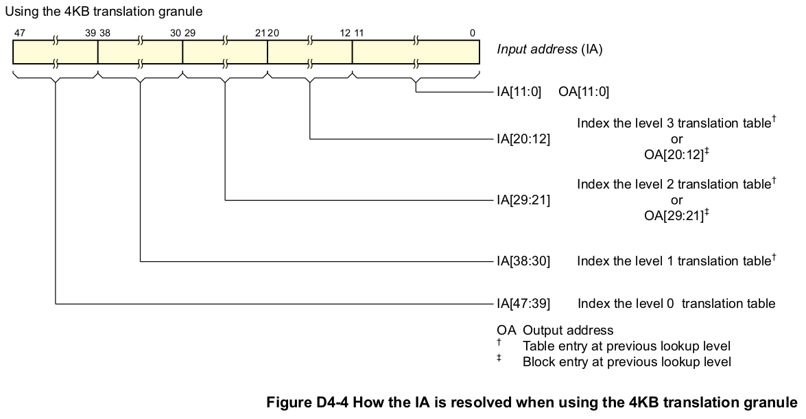

## D4.2.3 Memory translation granule size

The memory translation granule size defines both:
* The maximum size of a single translation table.
* The memory page size. That is, the granularity of a translation table lookup.

VMSAv8-64 supports translation granule sizes of 4KB, 16KB, and 64KB. Support for each granule size is optional,
and is indicated as shown in Table D4-7:

In VMSAv8-64, each address translation stage is configured, independently, to use one of the supported granule
sizes.

> **NOTE:**  
* Using a larger granule size can reduce the maximum required number of levels of address lookup because:
    - The increased translation table size means the translation table holds more entries. This means a single lookup can resolve more bits of the input address.
    - The increased page size means more of the least-significant address bits are required to address a page. These address bits are flat mapped from the input address to the output address, and therefore do not require translation.
* ARM recommends that memory-mapped peripherals are separated by an integer multiple of the largest
granule size supported by the operating system or hypervisor, to allow each peripheral to be managed
independently.

Table D4-8 summarizes the effects of the different granule sizes.

### How the granule size affects the address translation process

As Table D4-8 on page D4-1651 shows, the translation granule determines the number of address bits:
* Required to address a memory page.
* That can be resolved in a single translation table lookup.

This means the translation granule determines how the input address (IA) is resolved to an output address (OA) by
the translation process.
Because a single translation table lookup can resolve only a limited number of address bits, the IA to OA resolution
requires multiple levels of lookup.
Considering the resolution of the maximum IA range of 48 bits, with a translation granule size of 2^n bytes:
* The least-significant n bits of the IA address the memory page. This means OA[(n-1):0]=IA[(n-1):0].
* The remaining (48-n) bits of the IA, IA[47:n], must be resolved by the address translation.
* A translation table descriptor is 8 bytes. Therefore:
    - A complete translation table holds 2(n-3) descriptors.
    - A single level of translation can resolve a maximum of (n-3) bits of address.  

  Consider the translation process, working back from the final level of lookup, that resolves the least
significant of the address bits that require translation. Because a level of lookup can resolve (n-3) bits of
address:
    - The final level of lookup resolves IA[(2n-4):n].
    - The previous level of lookup resolves IA[(3n-7):(2n-3)].

  However, the level of lookup that resolves the most significant bits of the IA might not require a full-sized
translation table. Therefore, in general, the address bits resolved in a level of lookup are:  
    IA[Min(47, ((x-3)(n-3)+2n-4)):(n+(x-3)(n-3))], where:

| | |
| -- | -- |
| Min(a, b) | Is a function that returns the minimum of a and b. |
| x | Indicates the level of lookup. This is defined so that the level that resolves the least significantbit of the translated IA bits is level 3. |
 
The following diagrams show this model, for each of the permitted granule sizes.
Figure D4-4 shows how a 48-bit IA is resolved when using the 4KB translation granule.

Figure D4-5 shows how a 48-bit IA is resolved when using the 16KB translation granule.

Figure D4-6 shows how a 48-bit IA is resolved when using the 64KB translation granule.

Later sections of this chapter give more information about the translation process, and explain the terminology used
in these figures.

### Effect of granule size on translation table addressing and indexing

Table D4-9 shows the effect of the translation granule size on the addressing and indexing of the TTBR, and on the
input address range that must be resolved.

Table D4-10 shows the IA bits resolved at each level of lookup, and how these correspond to the possible values of
x in Table D4-9.

Table D4-9 refers to accessing a complete translation table, of 4KB, 16KB, or 64KB. However, the ARMv8
translation system supports the following possible variations from the information in Table D4-9:

#### Reduced IA width

Depending on the configuration and implementation choices, the required input address width for
the initial level of lookup might be smaller than the number of address bits that can be resolved at
that level. This means that, for this initial level of lookup:
* The translation table size is reduced. For each 1 bit reduction in the input address size the size
of the translation table is halved.
> **NOTE:**  
    - This has no effect on the translation table size for subsequent levels of lookup, for which the lookups always use full-sized translation tables.
    - For a stage 2 translation, it might be possible to start the translation at a lower level, see Concatenated translation tables on page D4-1655.

* More low-order TTBR bits are needed to hold the translation table base address.

Example D4-1 on page D4-1655 shows how this applies to translating a 35-bit input address range
using the 4KB granule.

**Example D4-1 Effect of an IA width of 35 bits when using the 4KB granule size**
---
With a 4KB granule size, a single level of lookup can resolve up to 9 bits of IA. If an implementation has a 35-bit
input address range, IA[34:0], Table D4-10 on page D4-1654 shows that lookup must start at level 1, and that the
initial lookup must resolve IA[34:30], meaning it resolves 5 bits of address: This 4-bit reduction in the required
resolution means:
* The translation table size is divided by 24, giving a size of 256B.
* The TTBR requires 4 more bits for the translation table base address, which becomes TTBR[47:8].
---

When using the 64KB translation granule to translate the maximum IA size of 48 bits, Table D4-10
on page D4-1654 shows that a level 1 lookup must resolve only IA[47:42]. This is 6 bits of address,
compared to the 13 bits that can be resolved at a single level of lookup. This 7-bit reduction in the
required resolution means:
* The translation table size is divided by 27, giving a size of 512B.
* The TTBR requires 7 more bits for the translation table base address, which becomes
TTBR[47:9].

#### Concatenated translation tables
For stage 2 address translations, for the initial lookup, up to 16 translation tables can be
concatenated. This means additional IA bits can be resolved at that lookup level. Each additional IA
bit resolved:
* Doubles the number of translation tables required. Resolving an additional n bits requires 2n
   concatenated translation tables at the initial lookup level.
* Reduces by 1 bit the width of the translation table base address held in the TTBR.  

This means that, for the initial lookup of a stage 2 translation table, the IA ranges shown in
Table D4-10 on page D4-1654 can be extended by up to 4 bits. Example D4-2 shows how
concatenation can be used to resolve a 40-bit IA when using the 4KB translation granule.

**Example D4-2 Concatenating translation tables to resolve a 40-bit IA range, with the 4K granule**
---
Table D4-10 on page D4-1654 shows that, when using the 4KB translation granule, a level 1 lookup can resolve a
39-bit IA, with the first lookup resolving IA[38:30]. For a stage 2 translation, to extend the IA width to 40 bits and
resolve IA[39:30] with the first lookup:
* Two translation tables are concatenated, giving a total size of 8KB.
* The TTBR requires 1 fewer bit for the translation table base address, which becomes TTBR[47:13].

---
For more information, see Concatenated translation tables for the initial stage 2 lookup on
page D4-1671.

In all cases, the translation table, or block of concatenated translation tables, must be aligned to the actual size of
the table or block of concatenated tables.
The translation table base address held in the TTBR is defined in the OA map for that stage of address translation.
The information given in this section assumes this stage of translation has an OA size of 48 bits, meaning the
translation table base address is:
* TTBR[47:12] if using the 4KB translation granule.
* TTBR[47:14] if using the 16KB translation granule.
* TTBR[47:16] if using the 64KB translation granule.

If the OA address is smaller than 48 bits then the upper bits of this field must be written as zero. For example, for a
40-bit OA range:
* If using the 4KB translation granule:
    - TTBR[47:40] must be set to zero.
    - TTBR[39:12] holds the translation table base address.
* If using the 16KB translation granule:
    - TTBR[47:40] must be set to zero.
    - TTBR[39:14] holds the translation table base address.
* If using the 64KB translation granule:
    - TTBR[47:40] must be set to zero.
    - TTBR[39:16] holds the translation table base address.
In all cases, if TTBR[47:40] is not zero, any attempt to access the translation table generates an Address size fault.

