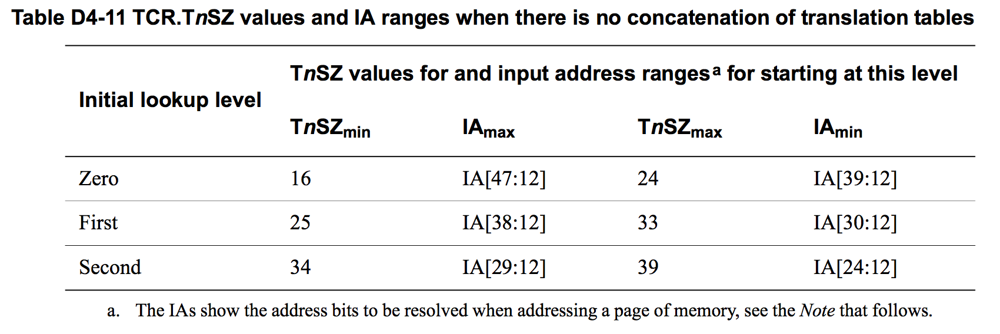

## D4.2.5 Overview of the VMSAv8-64 address translation stages

As shown in [Memory translation granule size on page D4-1651](#)
, the granule size determines significant aspects of the address translation process. [Effect of granule size on translation table addressing and indexing on page D4-1654](#)
shows, for each granule size:
* How the required input address range determines the required initial lookup levels.
* For stage 2 translations, the possible effect described in [Concatenated translation tables on page D4-1655](#).
* The TTBR addressing and indexing for the initial lookup.

The following subsections summarize the multiple levels of lookup that can be required for a single stage of address translation that might require the maximum number of lookups:

* [Overview of VMSAv8-64 address translation using the 4KB translation granule on page D4-1659](#). 
* [Overview of VMSAv8-64 address translation using the 16KB translation granule on page D4-1662](#). 
* [Overview of VMSAv8-64 address translation using the 64KB translation granule on page D4-1665](#).

### Overview of VMSAv8-64 address translation using the 4KB translation granule

The requirements for the level of the initial lookup are different for stage 1 and stage 2 translations.

#### Overview of stage 1 translations, 4KB granule

For a stage 1 translation, the required initial lookup level is determined only by the required input address range specified by the corresponding TCR.TxSZ field. When using the 4KB translation granule, Table D4-11 shows this requirement.

These configuration options are also permitted for stage 2 translations.

> **NOTE:**

