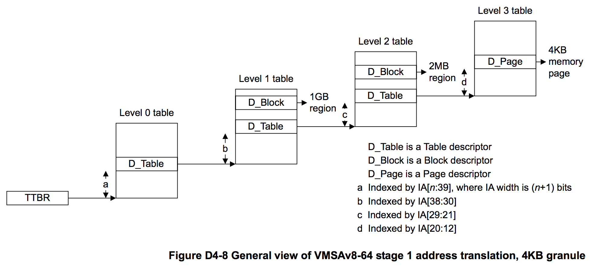

## D4.2.5 Overview of the VMSAv8-64 address translation stages

As shown in [Memory translation granule size on page D4-1651](#)
, the granule size determines significant aspects of the address translation process. [Effect of granule size on translation table addressing and indexing on page D4-1654](#)
shows, for each granule size:
* How the required input address range determines the required initial lookup levels.
* For stage 2 translations, the possible effect described in [Concatenated translation tables on page D4-1655](#).
* The TTBR addressing and indexing for the initial lookup.

The following subsections summarize the multiple levels of lookup that can be required for a single stage of address translation that might require the maximum number of lookups:

* [Overview of VMSAv8-64 address translation using the 4KB translation granule on page D4-1659](#). 
* [Overview of VMSAv8-64 address translation using the 16KB translation granule on page D4-1662](#). 
* [Overview of VMSAv8-64 address translation using the 64KB translation granule on page D4-1665](#).

### Overview of VMSAv8-64 address translation using the 4KB translation granule

The requirements for the level of the initial lookup are different for stage 1 and stage 2 translations.

#### Overview of stage 1 translations, 4KB granule

For a stage 1 translation, the required initial lookup level is determined only by the required input address range specified by the corresponding TCR.TxSZ field. When using the 4KB translation granule, Table D4-11 shows this requirement.

These configuration options are also permitted for stage 2 translations.

> **NOTE:**
* When using the 4KB translation granule, the initial lookup cannot be at level 3.
* Some bits of the IA do not require resolution by the translation table lookup, because they always map directly to the OA, When using the 4KB translation granule, IA[11:0] = OA[11:0] for all translations.

Figure D4-8 shows the stage 1 address translation, for an address translation using the 4KB granule with an input address size greater than 39 bits.

#### Overview of stage 2 translations, 4KB granule

For a stage 2 translation, up to 16 translation tables can be concatenated at the initial lookup level. For certain input address sizes, concatenating tables in this way means that the lookup starts at a lower level than would otherwise be the case. For more information see [Concatenated translation tables for the initial stage 2 lookup on page D4-1671.](#)
When using the 4KB translation granule, Table D4-12 shows all possibilities for the initial lookup for a stage 2 translation.

