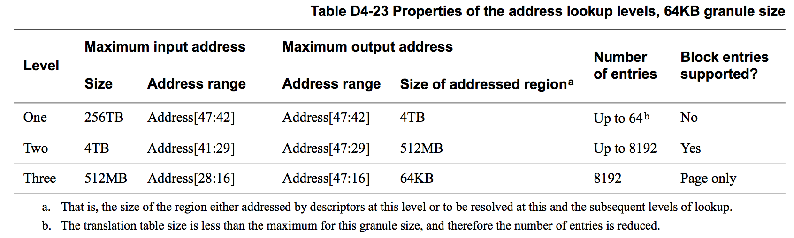
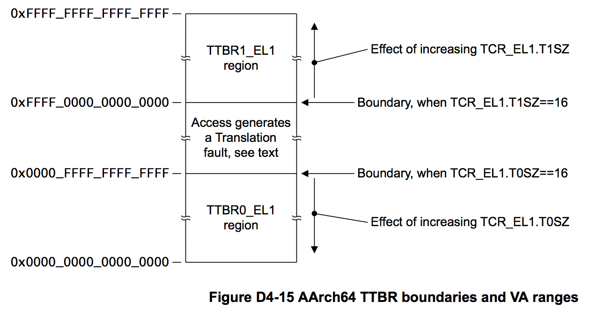

## D4.2.6 The VMSAv8-64 translation table format

This section provides the full description of the VMSAv8-64 translation table format, its use for address translations that are controlled by an Exception level using AArch64.
For the address translations that are controlled by an Exception level that is using AArch64:
* The TCR_EL1.{SH0, ORGN0, IRGN0, SH1, ORGN1, IRGN1} fields define memory region attributes for
the translation table walk, for each of TTBR0_EL1 and TTBR1_EL1.
* For the Secure and Non-secure EL1&0 stage 1 translations, each of TTBR0_EL1 and TTBR1_EL1 contains
an ASID field, and the TCR_EL1.A1 field selects which ASID to use.

For this translation table format, Overview of the VMSAv8-64 address translation stages on page D4-1658 summarizes the lookup levels, and Descriptor encodings, ARMv8 level 0, level 1, and level 2 formats on page D4-1696 describes the translation table entries.
The following subsections describe the use of this translation table format:

* Translation granule size and associate block and page sizes on page D4-1668.
* Selection between TTBR0 and TTBR1 on page D4-1670.
* Concatenated translation tables for the initial stage 2 lookup on page D4-1671.
* Possible translation table registers programming errors on page D4-1673.

### Translation granule size and associate block and page sizes

Table D4-20 shows the supported granule sizes, block sizes and page sizes, for the different granule sizes. For completeness, this table includes information for AArch32 state. In the table, the OA bit ranges are the OA bits that the translation table descriptor specifies to address the block or page of memory, in an implementation that supports a 48-bit OA range.

Bit[1] of a translation table descriptor identifies whether the descriptor is a block descriptor, and:
* The 4KB granule size supports block descriptors only in level 1and level 2 translation tables.
* The 16KB and 64KB granule sizes support block descriptors only in level2 translation tables,
Setting bit[1] of a descriptor to 0 in a translation table that does not support block descriptors gives a Translation fault.
For translations managed from AArch64 state, the following tables expand the information for each granule size, showing for each lookup level and when accessing a single translation table:
* The maximum IA size, and the address bits that are resolved for that maximum size.
* The maximum OA range resolved by the translation table descriptors at this level, and the corresponding
memory region size.
* The maximum size of the translation table. This is the size required for the maximum IA size.
Table D4-21 shows this information for the 4KB translation granule size, Table D4-22 on page D4-1669 shows this information for the 16KB translation granule size, and Table D4-23 on page D4-1669 shows this information for the 64KB translation granule size.

For the initial lookup level:
* If the IA range specified by the TCR.TxSZ field is smaller than the maximum size shown in these table then this reduces the number of addresses in the table and therefore reduces the table size. The smaller translation table is aligned to its table size.
* For stage 2 translations, multiple translation tables can be concatenated to extend the maximum IA size beyond that shown in these tables. For more information see the stage 2 translation overviews in Overview of the VMSAv8-64 address translation stages on page D4-1658 and Concatenated translation tables for the initial stage 2 lookup on page D4-1671.

If a supplied input address is larger than the configured input address size, a Translation fault is generated.

> **NOTE:**
Larger translation granule sizes typically requires fewer levels of translation tables to translate a particular size of virtual address.

For the TCR programming requirements for the initial lookup, see Overview of the VMSAv8-64 address translation stages on page D4-1658.

### Selection between TTBR0 and TTBR1

Every translation table walk starts by accessing the translation table addressed by the TTBR for the stage 1 translation for the required translation regime.
For the EL1&0 translation regime, the VA range is split into two subranges as shown in Figure D4-15, and:
* TTBR0_EL1 points to the initial translation table for the lower VA subrange, that starts at address
0x0000_0000_0000_0000,
* TTBR1_EL1 points to the initial translation table for the upper VA subrange, that runs up to address
0xFFFF_FFFF_FFFF_FFFF.

Which TTBR is used depends only on the VA presented for translation:
* If the top bits of the VA are zero, then TTBR0_EL1 is used.
* If the top bits of the VA are one, then TTBR1_EL1 is used.

It is configurable whether this determination depends on the values of VA[63:56] or on the values of VA[55:48], see Address tagging in AArch64 state on page D4-1638.

> **NOTE:**
The handling of the Contiguous bit can mean that the boundary between the translation regions defined by the
TCR_EL1.TnSZ values and the region for which an access generates a Translation fault is wider than shown in Figure D4-15. That is, if the descriptor for an access to the region shown as generating a fault has the Contiguous bit set to 1, the access might not generate a fault. Possible translation table registers programming errors on page D4-1673 describes this possibility.

Example D4-3 on page D4-1671 shows a typical application of this VA split.

Example D4-3 Example use of the split VA range, and the TTBR0_EL1 and TTBR1_EL1 controls

---
**TTBR0_EL1**
Used for process-specific addresses.
Each process maintains a separate level 1 translation table. On a context switch:
• TTBR0_EL1 is updated to point to the level 1 translation table for the new context
• TCR_EL1 is updated if this change changes the size of the translation table
• CONTEXTIDR_EL1 is updated.

**TTBR1_EL1**
Used for operating system and I/O addresses, that do not change on a context switch.
---

For each VA subrange, the input address size is 2(64-TnSZ), where TnSZ is one of TCR_EL1.{T0SZ, T1SZ}, This means the two VA subranges are:
Lower VA subrange 0x0000_0000_0000_0000 to (2(64-T0SZ) - 1).
Upper VA subrange (264 - 2(64-T1SZ)) to 0xFFFF_FFFF_FFFF_FFFF.
The minimum TnSZ value is 16, corresponding to the maximum input address range of 48 bits. Example D4-4 shows the two VA subranges when T0SZ and T1SZ are both set to this minimum value.

Example D4-4 Maximum VA ranges for EL1&0 stage 1 translations
---
The maximum VA subranges correspond to T0SZ and T1SZ each having the minimum value of 16. In this case the subranges are:
Lower VA subrange 0x0000_0000_0000_0000 to 0x0000_FFFF_FFFF_FFFF. 
Upper VA subrange 0xFFFF_0000_0000_0000 to 0xFFFF_FFFF_FFFF_FFFF.
---

Figure D4-15 on page D4-1670 indicates the effect of varying the TnSZ values.
As described in Overview of the VMSAv8-64 address translation stages on page D4-1658, the TnSZ values also
determine the initial lookup level for the translation.

### Concatenated translation tables for the initial stage 2 lookup

Overview of the VMSAv8-64 address translation stages on page D4-1658 introduced the ability to concatenate translation tables for the initial stage 2 translation lookup. This section gives more information about that concatenation.
Where a stage 2 translation would require 16 entries or fewer in its top-level translation table, the system designer can instead:
* Require the corresponding number of concatenated translation tables at the next translation level, aligned to the size of the block of concatenated translation tables.
* Start the translation at that next translation level.

In addition, when using the 16KB translation granule and requiring a 48-bit input address size for the stage 2 translations, lookup must start with two concatenated translation tables at level 1.