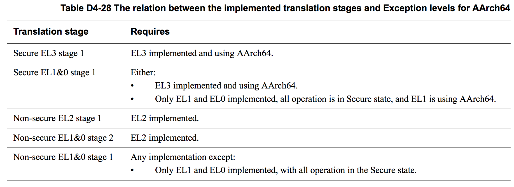

## D4.2.9 The implemented Exception levels and the resulting translation stages and regimes

Elsewhere, this chapter describes an implementation that includes all Exception levels, and describes the control of address translation by Exception levels that are using AArch64. This subsection describes how the address translation scheme changes if an implementation does not include all of the Exception levels.

If an implementation does not include EL3, it has only a single Security state, with MMU controls equivalent to the Secure state MMU controls.

If an implementation does not include EL2 then:
* If it also does not include EL3, the MMU provides only a single EL1&0 stage 1 translation regime. 
* If it includes EL3, the MMU provides an EL1&0 stage 1 translation regime in each Security state.

Figure D4-2 on page D4-1642 shows the set of translation regimes for an implementation that implements all of the Exception levels. Table D4-28 shows how the supported translation stages depend on the implemented Exception levels, and in some cases on the Execution state being used by the highest implemented Exception level.

