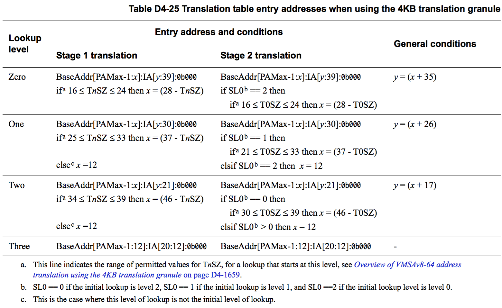

## D4.2.7 The algorithm for finding the translation table entries

This subsection gives the algorithms for finding the translation table entry that corresponds to a given IA, for each required level of lookup. The algorithms encode the descriptions of address translation given earlier in this section. The algorithm details depend on the translation granule size for the stage of address translation, see:
* [Finding the translation table entry when using the 4KB translation granule on page D4-1675](#).
* [Finding the translation table entry when using the 16KB translation granule on page D4-1676](#).
* [Finding the translation table descriptor when using the 64KB translation granule on page D4-1677](#).
Each subsection uses the following terms:

**BaseAddress**
The base address for the level of lookup, as defined by:
* For the initial lookup level, the appropriate TTBR.
* Otherwise, the translation table address returned by the previous level of lookup.

**PAMax**
The supported PA width, in bits.

**IA**
The supplied IA for this stage of translation.

**TnSZ**
The translation table size for this stage of translation:
For EL1&0 stage 1 -- TCR_EL1.T0SZ or TCR_EL1.T1SZ, as appropriate. 
For EL1&0 stage 2 -- VTCR_EL2.T0SZ.
For EL2 stage 1 -- TCR_EL2.T0SZ.
For EL3 stage 1 -- TCR_EL3.T0SZ.

**SL0**
VTCR_EL2.SL0. Applies to the Non-secure EL1&0 stage 2 translation only.

These subsections show only architecturally-valid programming of the TCR. See also [Possible translation table registers programming errors on page D4-1673](#).

### Finding the translation table entry when using the 4KB translation granule

Table D4-25 shows the translation table descriptor address, for each level of lookup, when using the 4KB translation granule. See the start of [The algorithm for finding the translation table entries on page D4-1674](#) for more information about terms used in the table.

Table D4-7 on page D4-1651 shows how software can determine whether an implementation supports the 4KB granule size.

