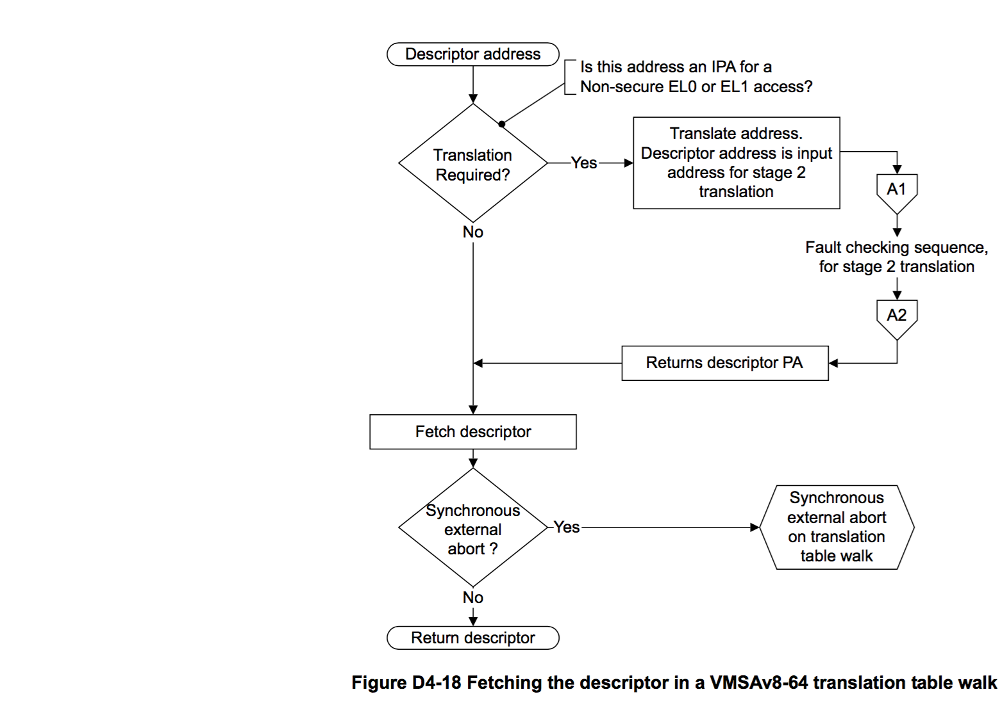

## D4.3.3 Memory attribute fields in the VMSAv8-64 translation table format descriptors

[Memory region attributes on page D4-1712](#) describes the region attribute fields. The following subsections summarize the descriptor attributes as follows:  
**Table descriptor**  
Table descriptors for stage 2 translations do not include any attribute field. For a summary of the attribute fields in a stage 1 table descriptor, that define the attributes for the next lookup level, see Next-level attributes in stage 1 VMSAv8-64 Table descriptors.  
**Block and page descriptors**  
These descriptors define memory attributes for the target block or page of memory. Stage 1 and stage 2 translations have some differences in these attributes, see:  
* Attribute fields in stage 1 VMSAv8-64 Block and Page descriptors on page D4-1700
* Attribute fields in stage 2 VMSAv8-64 Block and Page descriptors on page D4-1701.

### Next-level attributes in stage 1 VMSAv8-64 Table descriptors

In a Table descriptor for a stage 1 translation, bits[63:59] of the descriptor define the attributes for the next-level translation table access, and bits[58:52] are IGNORED:

These attributes are:

**NSTable, bit[63]**  
For memory accesses from Secure state, specifies the Security state for subsequent levels of lookup, see Hierarchical control of Secure or Non-secure memory accesses on page D4-1703.
For memory accesses from Non-secure state, this bit is RES0 and is ignored by the PE. This field is RES1 in the AArch64 EL2 translation regime.

**APTable, bits[62:61]**  
Access permissions limit for subsequent levels of lookup, see Hierarchical control of data access permissions on page D4-1706.
APTable[0] is RES0:
* In the EL2 translation regime. 
* In the EL3 translation regime.