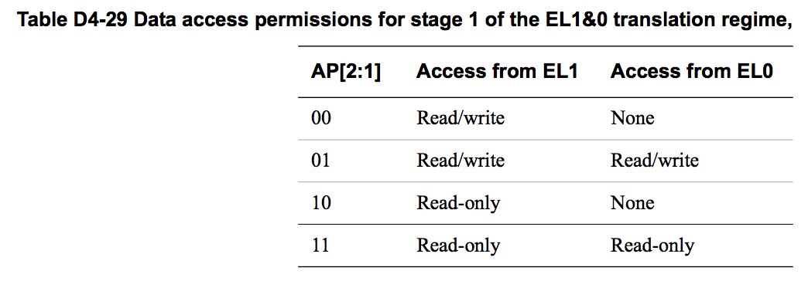

## D4.4.1 Memory access control

The access control fields in the translation table descriptors determine whether the PE, in its current state, is permitted to perform the required access to the output address given in the translation table descriptor. If a translation stage does not permit the access then an MMU fault is generated for that translation stage, and no memory access is performed.  
The following sections describe the memory access controls:
* [About the access permissions](#).
* [The data access permission controls on page D4-1705](#).
* [Access permissions for instruction execution on page D4-1707](#).
* [The Access flag on page D4-1711](#).

### About the access permissions

> **NOTE:**  
> This section gives a general description of memory access permissions. In an implementation that includes EL2, software executing at EL1 in Non-secure state can see only the access permissions defined by the Non-secure EL1&0 stage 1 translations. However, software executing at EL2 can modify these permissions. This modification is invisible to the Non-secure software executing at EL1 or EL0.

The access permission bits control access to the corresponding memory region. The VMSAv8-64 translation table format:
* In stage 1 translations, uses AP[2:1] to define the data access permissions, see The AP[2:1] data access permissions, for stage 1 translations on page D4-1705.
 > **NOTE:**  
 The description of the access permission field as AP[2:1] is for consistency with the VMSAv8-32 Short-descriptor translation table format, see The VMSAv8-32 Short-descriptor translation table format on page G4-4015. The VMSAv8-64 translation table format does not define an AP[0] bit.
* In stage 2 translations, uses S2AP[1:0] to define the data access permissions, see The S2AP data access permissions, Non-secure EL1&0 translation regime on page D4-1706.
* Uses the UXN, XN and PXN bits to define access controls for instruction fetches, see Access permissions for instruction execution on page D4-1707.

An attempt to perform a memory access that the translation table access permission bits do not permit generates a Permission fault, for the corresponding stage of translation.
> **NOTE: **  
> In an implementation that includes EL2, each stage of the translation of a memory access made from Non-secure EL1 or EL0 has its own, independent, permission check.

### The data access permission controls

The following subsubsections describe the data access permission controls:
* The AP[2:1] data access permissions, for stage 1 translations.
* The S2AP data access permissions, Non-secure EL1&0 translation regime on page D4-1706.
* Hierarchical control of data access permissions on page D4-1706.

**The AP[2:1] data access permissions, for stage 1 translations**  
For the VMSAv8-64 EL1&0 translation regime, the AP[2:1] bits control the stage 1 data access permissions, and:  

**AP[2]** Selects between read-only and read/write access.  
**AP[1]** Selects between Application level (EL0) and System level (EL1) control.  

This provides four permission settings for data accesses:
* Read-only at all levels.
* Read/write at all levels.
* Read-only at EL1, no access by software executing at EL0.
* Read/write at EL1, no access by software executing at EL0.

For translation regimes other than the EL1&0 translation regimes, AP[2] determines the stage 1 data access permissions, and AP[1] is:
* SBO.
* Ignored by hardware and is treated as if it is 1.

Table D4-29 shows the effect of the data access permission bits for stage 1 of the EL1&0 translation regime. In this table, an entry of None indicates that any access from that Exception level faults.

For the Non-secure EL1&0 translation regime:
* The stage 2 translation also defines data access permissions, see [The S2AP data access permissions, Non-secure EL1&0 translation regime on page D4-1706](#).
* When both stages of translation are enabled, [Combining the stage 1 and stage 2 data access permissions on page D4-1717](#) describes how these permissions are combined.

