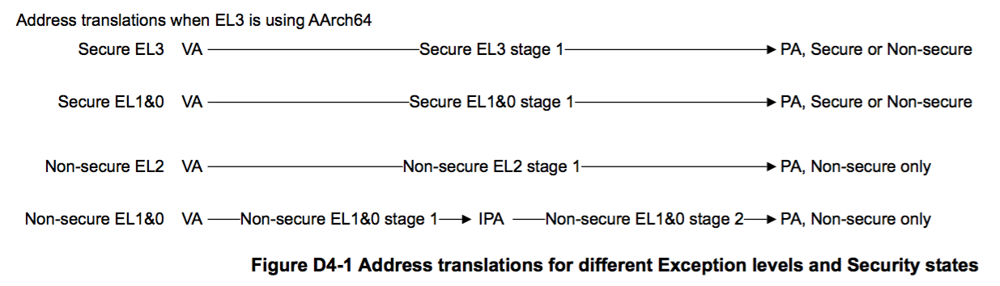

# D4.1 虚拟内存系统架构 (VMSA) 简介

[`英文版`](../../en/chapter_d4/d41_about_the_virtual_memory_system_architecture_v_.html)

此小节描述了 AArch64 运行态下的 PE 中的虚拟内存系统架构 (VMSA)，
即 VMSAv8-64 (Virtual Memory System Architecture on AArch64)。

VMSA 包含内存管理单元，即 MMU。MMU 在系统中为 PE 的内存操作提供地址转换，
访问权限控制以及内存属性的设定和校验功能。

MMU 中的地址转换过程，是将 PE 发起的内存访问的虚拟地址 (VAs)
映射到物理内存设备的真实物理地址 (PAs) 上。这一转换过程，会因 PE 所在的
Exception levels 和所处的 Security states 的不同而不同，具体的差异可以参考 Figure D4-1。
(*TODO: 简单解释下图中的转换过程*)

> VMSAv8-64 supports tagging of VAs,
 >as described in [Address tagging in AArch64 state](todo.md).
> As that section describes,
 > this address tagging has no effect on the address translation process.

VMSAv8-64 支持 VAs 的 tagging，address tagging 不会对地址转换的处理产生影响，后续的[D4.1.1 AArch64 下的 Address Tagging ](d41_1_address_tagging_in_aarch64_state.md)小节会对此进行详细的描述。

> The remainder of this chapter gives a full description of VMSAv8-64
 > for an implementation that includes all of the Exception levels.
> [The implemented Exception levels and the resulting translation stages and regimes on
 >page D4-1679](todo.md) describes the differences in the VMSA
 > if some Exception levels are not implemented.
 
本章节后续的内容将对实现了所有 Exception levels 的系统上的 VMSAv8-64 进行详细的介绍。
对于只实现了部分 Exception levels 的系统上的 VMSAv8-64，可以参考
[The implemented Exception levels and the resulting translation stages and regimes on page D4-1679](todo.md) 
章节的描述
