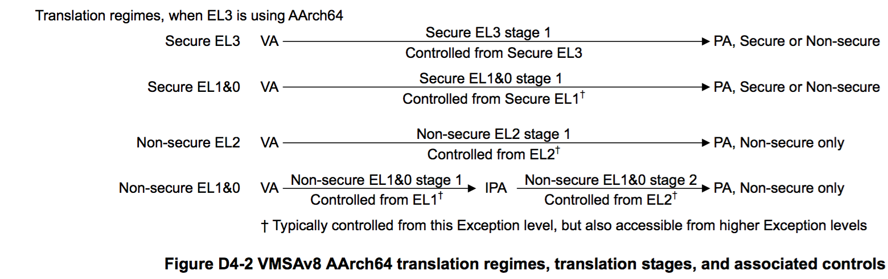

## D4.2.1 VMSAv8-64 地址转换系统简介

[`英文版`](../../en/chapter_d4/d42_1_about_the_vmsav8-64_address_translation_syste.html)

内存管理单元 (MMU，Memory Management Unit) 的主要功能是对 PE 发起的内存访问，进行地址转换、访问权限控制、内存属性配置和检查。

通常，PE 发起内存访问时，MMU 会截获该访问，然后根据访问的输入地址，即 IA (Input Address)，做下面的操作：
* 返回输入地址 IA 所对应的输出地址 OA (Output Address)，以及 OA 所指向的内存属性信息。
* 如果 MMU 无法进行地址转换操作，那么就会产生 MMU fault exception。MMU fault 根据产生时所在的转换 stage 的不同，可以分为 stage 1 MMU fault 和 stage 2 MMU fault 两大类。

从 IA 映射到 OA 处理过程定义为地址转换 (address translation)，或者单阶段地址转换 (single stage of address translation)。

VMSAv8-64 还定义了多个 translaton regimes，一个 translation regime 包含下面两个中的其中一个：
* 将 IA 映射到 OA 的单阶段的 address translation。
* 连续的两个阶段的 address translation。
    - 第一阶段，将输出的 VA 转换为中间物理地址 (IPA，intermediate physical address)
    - 第二阶段，将 IPA 转换为 PA。

Address translation 中，IA 到 OA 的映射是按内存块进行的。Translation granule 则定义了 IA 映射到 OA 的粒度，即映射块的大小，这个粒度会影响以下的两个方面：
* 单个阶段的 address translation 中的页面大小，即一次 IA 到 OA 映射所支持的最小内存块的大小。 
* 单个阶段的 address translation 的 translation table 所占内存的最大值。

>> **NOTE:**

>> * In the ARM architecture, a software agent, such as an operating system, that uses or defines stage 1 memory translations, might be unaware of the second stage of translation, and of the distinction between IPA and PA.
>> * A more generalized description of the translation regimes is that a regime  always comprises two sequential stages of translation, but in some regimes the stage 2 translation both:
>>   - Returns an OA that equals the IA. This is called a flat mapping of the IA to the OA.
>>   - Does not change the memory attributes returned by the stage 1 address translation.

通过 System registers，可以单独控制 MMU 的各个 address translation stage 的使能和关闭。[The effects of disabling a stage of address translation
on page D4-1677](#) 小节描述了在 address translation stage 被关闭时，MMU 的处理逻辑。

> **NOTE:**

> * 在 ARM 架构中，使用 stage 1 memory translations 的 software agent，例如操作系统，可能感知不到 second stage of translation，以及 IPA 和 PA 的区别. 
> * 对于 translation regimes，一种更通用的定义如下：  
translation regime 包含两个连续的 translation stages，其中部分 regimes 的 stage 2 translation 如下:
>   - 返回的 OA 与 IA 相同，此时称为 flat mapping of the IA to the OA.
>   - Stage 2 不改变 stage 1 中得到的内存属性。

For an access to a stage of address translation that does not generate an MMU fault, the MMU translates the IA to the corresponding OA. System registers are used to report any faults that occur on a memory access.  
This section describes the address translation system for an implementation that includes all of the Exception levels, and gives a complete description of translations that are controlled by an Exception level that is using AArch64.  
Figure D4-2 shows these translation stages and translation regimes when EL3 is using AArch64.

在一个 stage 的 address translation 中，如果没有产生 MMU fault，那么 MMU 就会把 IA 转换为对应的 OA，如果产生了 MMU fault，那么在 System registers 中会记录该 MMU faults。  
在本章节中，所描述的地址转换系统，都是基于实现了所有 Exception levels，并且运行在 AArch64 下的实现。  
Figure D4-2 描述了 EL3 在 AArch64 运行态下的 translation stages 和 translation regimes。

> [ARMv8 VMSA naming on page D4-1643](#) gives more information about the options for the different stages of address translation shown in Figure D4-2, and:

> * Chapter G4 The AArch32 Virtual Memory System Architecture describes:  
   - The translation stages and translation regimes when EL3 is using AArch32.
   - Any stages of address translation that are using VMSAv8-32 when EL3 is using AArch64.
> * [The implemented Exception levels and the resulting translation stages and regimes on page D4-1679](#) describes the effect on the address translation model when some Exception levels are not implemented.

[ARMv8 VMSA 命名](#) 小节提供了更多关于不同 stage 的 address translation 相关的信息，另外：
* Chapter G4 The AArch32 Virtual Memory System Architecture 描述了：
    - EL3 在 AArch32 运行态下的 translation stages 和 translation regimes。
    - EL3 在 AArch64 运行态下，但是部分 stage 的 address translation 处于 AArch32 运行态时的场景。
* [The implemented Exception levels and the resulting translation stages and regimes on page D4-1679](#) 章节描述了在部分 Exception levels 没有实现的情况下的 address translation 机制。

> Each enabled stage of address translation uses a set of address translations and associated memory properties held in memory mapped tables called translation tables. A single translation table lookup can resolve only a limited number of bits of the IA, and therefore a single address translation can require multiple lookups. These are described as different levels of lookup.

> Translation table entries can be cached in a Translation Lookaside Buffer (TLB).

每一个 stage 的 address translation 都会利用存储在 translation tables 中的地址转换规则和相关的内存属性信息来完成 address translation 功能。一次 address translation 会执行多次 translation table lookup 操作，每次 translation table lookup 处理 IA 特定位数的地址。这种操作也称作 different levels of lookup。  
Translation table 中的条目可以被缓存在 Translation Lookaside Buffer (TLB) 中。

> As well as defining the OA that corresponds to the IA, the translation table entries define the following properties:
> * Access to the Secure or Non-secure address map, for accesses made from Secure state.
* Memory access permission control.
* Memory region attributes.

> For more information, see [Memory attribute fields in the VMSAv8-64 translation table format descriptors on page D4-1699](#).

Translation table 条目不仅包含了 IA 所对应的 OA，还包含下面的相关信息：
* 对于处于 Secure state 的访问，指示 OA 是属于 Secure 还是 Non-secure state。
* 内存访问权限控制信息
* 内存区块属性信息

更多的信息可以参考章节 [Memory attribute fields in the VMSAv8-64 translation table format descriptors on page D4-1699](#)

> The following subsections give more information:
> * ARMv8 VMSA naming.
* VMSA address types and address spaces.
* About address translation on page D4-1644.
* The VMSAv8-64 translation table format on page D4-1644.

后续的小节主要描述下面的内容：
* ARMv8 VMSA 命名规则
* VMSA 中的 address type 和 address spaces
* address translation 简介
* VMSAv8-64 translation table 格式描述

> ### ARMv8 VMSA naming

### ARMv8 VMSA 命名规则

> The ARMv8 VMSA naming model reflects the possible stages of address translation, as follows:

> | | |
| -- | -- |
| VMSAv8  | The overall translation scheme, within which an address translation has one or two stages. |
| VMSAv8-32 | The translation scheme for a single stage of address translation that is managed from an Exception level that is using AArch32. |
| VMSAv8-64  | The translation scheme for a single stage of address translation that is managed from an Exception level that is using AArch64. |

ARMv8 VMSA 根据 address translation 的 stages 的不同，有以下 3 个命名：

| | |
| -- | -- |
| VMSAv8  | translation scheme 中所有存在 1 个或者 2 个 stages 的 address translation|
| VMSAv8-32 | translation scheme 中在运行态为 AArch32 的 EL 中进行的，只有一个 stage 的 address translation |
| VMSAv8-64 | translation scheme 中在运行态为 AArch64 的 EL 中进行的，只有一个 stage 的 address translation |

> ### VMSA address types and address spaces  

### VMSA 中的 address types 和 address spaces

> A description of the VMSA refers to the following address types.

>> **NOTE:**  
> These descriptions relate to the VMSAv8 description and therefore give more detail than the generic definitions given in the glossary.

本小节主要描述 VMSA 中涉及到的 address types

> **NOTE:**  
此处的描述是基于 VMSAv8的，因此会比一般的术语表中的描述包含更多的细节信息。

/
> #### Virtual address (VA)

> An address used in an instruction, as a data or instruction address, is a Virtual Address (VA).

>> **NOTE:**  
> This means that an address held in the PC, LR, SP, or an ELR, is a VA.  

> In AArch64 state, the VA address space has a maximum address width of 48 bits. With a single VA range this gives a maximum VA space of 256TB, with VA range of 0x0000_0000_0000_0000 to 0x0000_FFFF_FFFF_FFFF.  
However, for the EL1&0 translation stage the VA range is split into two subranges, one at the bottom of the full 64-bit address range of the PC, and one at the top, as follows:

> * The bottom VA range runs up from address 0x0000_0000_0000_0000. With the maximum address width of 48 bits this gives a VA range of 0x0000_0000_0000_0000 to 0x0000_FFFF_FFFF_FFFF.
* The top VA subrange runs up to address 0xFFFF_FFFF_FFFF_FFFF. With the maximum address width of 48 bits this gives a VA range of 0xFFFF_0000_0000_0000 to 0xFFFF_FFFF_FFFF_FFFF. Reducing the address width for this subrange increases the bottom address of the range.

> This means that there are two VA subranges, each of up to 256TB.  
Each translation regime, that takes a VA as an input address, can be configured to support fewer than 48 bits of virtual address space, see [Address size configuration on page D4-1646](#).

#### Virtual address (VA)

Virtual Address (VA) 是用在 instruction 中，作为 data 或者 instruction 的地址。

> **NOTE:**  
也就是说，在寄存器 PC、LR、SP 或者 ELR 中保存的地址，都是 VA。
在 AArch64 state 下，VA 的位数最多可以为 48 位，VA 的范围为 0x0000_0000_0000_0000 到 0x0000_FFFF_FFFF_FFFF，支持 256TB 内存空间。

在 EL1&0 的 translation stage 中，VA 的范围被分割为两个区块，分别为：  
* 0x0000_0000_0000_0000 到 0x0000_FFFF_FFFF_FFFF 的内存空间块
* 0xFFFF_0000_0000_0000 到 0xFFFF_FFFF_FFFF_FFFF 的内存空间块

也就是说，在 EL1&0 中，支持两个大小为 256TB 的 VA 空间。  
另外，每个 translation regime 都可以将 VA 的位数配置为 48 位一下。

> #### Intermediate physical address (IPA)

> In a translation regime that provides two stages of address translation, the IPA is:
* The OA from the stage 1 translation.
* The IA for the stage 2 translation.

> In a translation regime that provides only one stage of address translation, the IPA is identical to the PA. Alternatively, the translation regime can be considered as having no concept of IPAs.  
The IPA address space has a maximum address width of 48 bits, see [Address size configuration on page D4-1646](#).

#### Intermediate physical address (IPA)

在包含 2 个 stage address translation 的 translation regime 中， IPA 的含义如下：
* stage 1 translation 的 OA
* stage 2 translation 的 IA

在只包含 1 个 stage address translation 的 translation regime 中， 
IPA 与 PA 相同，或者理解为没有 IPA。  
IPA 最多支持 48 位，更多信息参考 [Address size configuration on page D4-1646](#) 章节。

> #### Physical address (PA)

> The address of a location in a physical memory map. That is, an output address from the PE to the memory system.  
The EL3 and Secure EL1 Exception levels provide independent definitions of physical address spaces for Secure and Non-secure operation. This means they provide two independent address spaces, where:
* A VA accessed in Secure state can be translated to either the Secure or the Non-secure physical address space.
* When in Non-secure state, a VA is always mapped to the Non-secure physical address space.

> Each PA address space has a maximum address width of 48 bits, but an implementation can implement fewer than 48 bits of physical address. See [Address size configuration on page D4-1646](#).

#### Physical address (PA)

PA 是指向物理内存存储单元的地址。同时，也是 PE 输出给 memory system 的地址。  
在 EL3 和 Secure EL1 上，对物理地址空间的访问，可以分为相互独立的 Secure 和 Non-secure 两种类别。也可以说，在这两个 EL 上，提供了两个独立的地址空间：
* 在 Secure state 下对一个 VA 的访问，可能最终访问到 Secure 物理内存区域，也可能最终访问到 Non-secure 物理内存区域。
* 在 Non-secure state 下对一个 VA 的访问，最终必然是访问到 Non-secure 的物理内存区域。
* 

PA 最多支持 48 位，在具体实现时，PA 的位数可以少于 48。更多的信息参考 [Address size configuration on page D4-1646](#) 章节

> ### About address translation

> For a single stage of address translation, a Translation table base register (TTBR) indicates the start of the first translation table required for the mapping from input address to output address. Each implemented translation stage shown in [VMSAv8 AArch64 translation regimes, translation stages, and associated controls on page D4-1642](#) requires its own set of translation tables.  
For the EL1&0 stage 1 translation, the split of the VA mapping into two subranges requires two tables, one for the lower part of the VA space, and the other for the upper part of the VA space. [Example use of the split VA range, and the TTBR0_EL1 and TTBR1_EL1 controls on page D4-1671](#) shows how these ranges might be used.  
[Controlling address translation stages on page D4-1645](#) summarizes the system control registers that control address translation by the MMU.  
A full translation table lookup is called a *translation table walk*. It is performed automatically by hardware, and can have a significant cost in execution time. To support fine granularity of the VA to PA mapping, a single IA to OA translation can require multiple accesses to the translation tables, with each access giving finer granularity. Each access is described as a level of address lookup. The final level of the lookup defines:
* The high bits of the required output address.
* The attributes and access permissions of the addressed memory.

> Translation table entries can be cached in a Translation Lookaside Buffer, see [Translation Lookaside Buffers (TLBs) on page D4-1729](#).

### About address translation

TTBR (Translation table base register) 保存着将输入地址映射到输出地址的 translation table 的基地址。在 [VMSAv8 AArch64 translation regimes, translation stages, and associated controls on page D4-1642](#) 章节中描述的每一个 translation stage 都由各自的 translation tables。  
在 EL1&0 stage 1 translation 中，VA 被划分了两个区块，各个区块都需要一个 translation table。 [Example use of the split VA range, and the TTBR0_EL1 and TTBR1_EL1 controls on page D4-1671](#) 章节中，描述了两个区块的具体细节。  
[Controlling address translation stages on page D4-1645](#) 章节描述了 MMU 是如何通过 system control registers 来控制 address translation。  
完成 VA 到 PA 转换的一系列 translation table lookup 称为 translation table walk。它是由硬件自动执行的，and can have a significant cost in execution time. 为了完成一次从 VA 到 PA 的映射，需要访问多次 translation table，一次访问则称为 a level of address lookup。地址转换过程中，每多一次访问都会返回一个更精确的结果。最后一次 lookup 会返回以下的内容：
* OA 的高位数值
* 被访问的内存的属性和访问权限。

Translation table 的条目可以被缓存在 Translation Lookaside Buffer 中，更多信息参考 [Translation Lookaside Buffers (TLBs) on page D4-1729](#) 章节。

### The VMSAv8-64 translation table format

Stages of address translation that are controlled by an Exception level that is using AArch64 use the VMSAv8-64 translation table format. This format uses 64-bit descriptor entries in the translation tables.

> **NOTE:**  
This format is an extension of the VMSAv8-32 Long-descriptor translation table format originally defined by the ARMv7 Large Physical Address Extension, and extended slightly by ARMv8. VMSAv8-32 also supports a Short-descriptor translation table format. [Chapter G4 The AArch32 Virtual Memory System Architecture](#) describes both of these formats.

The VMSAv8-64 translation table format provides:
* Up to four levels of address lookup.
* Input addresses of up to 48 bits.
* Output addresses of up to 48 bits.
* A translation granule size of 4KB, 16KB, or 64KB.

### The VMSAv8-64 translation table format

在 AArch64 state 下的 Exception level 的 address translation 的 translation table 的条目是一个 64 位的描述符。

> **NOTE:**
ARMv7 中定义了 VMSAv8-32 Long-descriptor translation table format，用于 Large Physical Address Extension。在 ARMv8 中基于该 format 扩展并定义了 VMSAv8-64 translation table format。VMSAv8-32 还支持一种 Short-descriptor translation table format，更多信息可以参考 [Chapter G4 The AArch32 Virtual Memory System Architecture](#) 章节中的描述。

VMSAv8-64 translation table format 包含以下内容：
* 最多支持 4 级的 address lookup
* 最多支持 48 位的 IA
* 最多支持 48 位的 OA
* translation granule 可以支持 4KB、16KB 和 64KB 三种。

