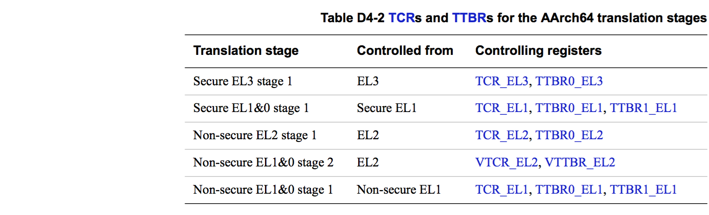
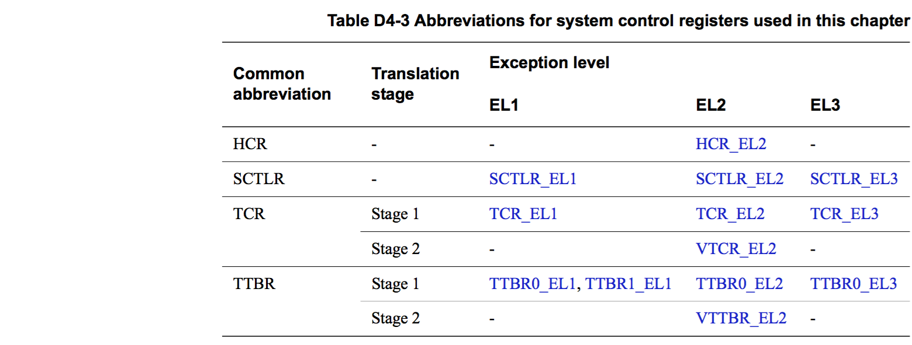
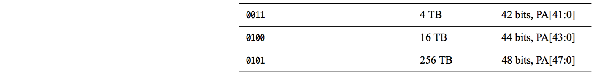
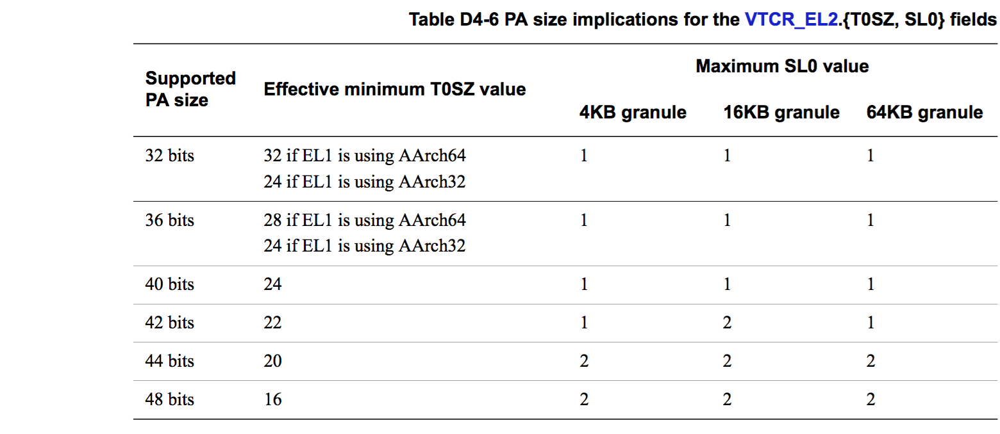

## D4.2.2 Address translation stages 配置

[`英文版`](../../en/chapter_d4/d42_2_controlling_address_translation_stages.html)

[The implemented Exception levels and the resulting translation stages and regimes on page D4-1679](#) 章节中定义了 translation regimes 和 stages。
对于每一个 address translation stage：
* 在 system control register 中，都有一个 bit 来使能该 address translation stage。
* 在 system control register 中，都有一个 bit 来配置 translation table lookups 的大小端
* 如果一个 address translation stage 支持两个 VA 区块，那么该 stage 会有以下的寄存器：
    - 一个 TCR
    - 两个 TTBR，分别用于配置两个 VA 区块的 translation table base。  
    TTBR 保存着 address translation stage 中的第一个 lookup 的 translation table 的基地址。

在 AArch64 运行态时，address translation stages 有以下的一些配置项：
* Table D4-1 中描述了各个 address translation stage 的 endianness 和 MMU enable 的控制：
    
    (译者注： EE 为 endianess 选择位， M 为 MMU 使能位)
    > **NOTE:**  
    If the PA of the software that enables or disables a particular stage of address translation differs from its VA, speculative instruction fetching can cause complications. ARM strongly recommends that the PA and VA of any software that enables or disables a stage of address translation are identical if that stage of translation controls translations that apply to the software currently being executed.  
    (TODO: 这段含义暂时没有理解，是说在 enable 或者 disable 的前，最好让 PA 和 VA 都保持一致么？)

* Table D4-2 中汇总了各个 address translation stage 所对应的 TCR 和 TTBR。
    

> The following subsections give more information about controlling address translation:
* System control registers relevant to MMU operation.
* Address size configuration.
* Atomicity of register changes on changing virtual machine on page D4-1650.
* Use of out-of-context translation regimes on page D4-1650.

后续的几个章节更详细的描述了 address translation 相关的配置：
* System control registers 中 MMU 相关的配置.
* Address size 配置.
* Atomicity of register changes on changing virtual machine on page D4-1650.
* Use of out-of-context translation regimes on page D4-1650.

### System control registers 中 MMU 相关配置

在 AArch64 state 下，本文使用不同的后缀来标示某一个 system control register 允许被访问到的最低 Exception level。(例如，TCR_EL2 可以在 EL2&3 中访问， 不能在 EL0&1 中访问，TCR_EL3只能在 EL3 中访问)。本文中在描述通用的 MMU 配置和 address translation 时，会使用通用的缩略词，这些缩略词用来描述 translation regimes 中的共性的部分。

> **NOTE:**
只有 Non-secure EL1&0 translation regime 才有 stage 2 translation。

### Address size 配置

下面的小节主要描述各个 address translation stage 中的 PA、IA 和 OA size。

#### Physical address size

ID_AA64MMFR0_EL1.PARange 用于指示所支持的 physical address size:

 

PARange 其他任何值都作为保留使用。

#### Output address size

在 address translation stage 使能后，对应的 TCR.IPS 或者 TCR.PS 必须正确的设定，该寄存器位用于设定 address translation stage 支持的最大 output address size，详细的配置参考 Table D4-5：

> **NOTE:**  
* TCR_EL1 寄存器中的 output address size 配置位的名称为 IPS (Intermediate Physical Address Size)，其他 EL 的 TCR 寄存器中的名称为 PS (Physical Address Size)
* {I}PS 包含 3 个 bits，与 Table D4-4 中 PARange 低 3 个 bits 相对应。

如果 {I}PS 中设定的 output address size 比实际支持的 physical address size (参考 Table D4-4) 大，那么 PE 会忽略 {I}PS 中的设定，并以实际的 physical address size 作为 output address size，也就是说 output address size 永远不可能比实际的 physical address size 大。另外，在具体的软件实现中，不应该依赖于这一特性，需要正确的去配置 {I}PS。

TTBR、translation table entries 和 output address 中的 address 超过 output address size 比特位设置必须设定为 0，否则会在 translation 的相关阶段触发 address size fault。TTBR 中设置错误触发的 address size fault 称为 level 0 fault。如果 stage 1 translation 关闭时，input address 大于实际支持的 physical address size，那么就会触发 stage 1 level 0 Address size fault。
对于有 2 个 stages 的translation：
* 如果 stage 2 translation 关闭时，stage 1 translation 的 output address 大于实际支持的 physical address size，那么就会触发 stage 1 address size fault
* 如果 stage 2 translation 使能时，stage 1 translation 没有触发address size fault，但是 output address 大于 stage 2 translation 的 input address size，那么就会触发 stage 2 translation fault。

(译者注：IPS for Intermediate Physical Address Size，PS for Physical Address Size)

#### Input address size

在各个 address translation stage 中，都有用于配置 input address size 的 TCR.T0SZ 或者 TCR.T1SZ 比特位：

* TCR_EL1 有 T0SZ 和 T1SZ，分别用于配置两个 VA 区块：
    - TCR_EL1.T0SZ 用于底部的 VA 区块，对应的 TTBR 为 TTBR0_EL1。
    - TCR_EL1.T1SZ 用于顶部的 VA 区块，对应的 TTBR 为 TTBR1_EL1。
* 其他 EL 的 TCR 中只有一个 T0SZ，并且该 EL 只有一个 TTBR 用于 address translation
* 对于只有一个 T0SZ 的 TCR，input address map 如 Figure D4-3 所示：
    
* 对于有 T0SZ 和 T1SZ 的 TCR，该 stage 中的 input address 必然是 VA，章节 [Selection between TTBR0 and TTBR1 on page D4-1670](#) 描述了其 VA address map。

在 Non-secure  EL1&0 translation regime 中，在 2 个 stage 都使能时，如果在 stage 1 translation 没有触发 stage 1 address size fault，并且其 output address 大于 VTCR_EL2.T0SZ 所设定的 stage 2 input address size 时，就会触发 stage 2 translation fault。  
软件可以将 input address size 设定为小于 48 bits，但是在具体实现中，AArch64 TTBRs 必须支持到 48 bits。
章节 [Overview of the VMSAv8-64 address translation stages on page D4-1658](#) 更详细的描述了 input address size、TxSZ、initial lookup level 和 translation granule 直接的相互关系。

**For all translation stages**  
TxSZ 的最大值为 39，如果软件向 TxSZ 中写入超过 39 的值，那么根据不同的实现，可能会有以下两种结果：
* 除了直接读取时会返回写入的值，其他处理过程中，都会以最大值 39 来处理。
* 任何使用 TxSZ 的处理过程都会触发 level 0 translation fault。

**For a stage 1 translation**  
TxSZ 的最大值为 16，如果软件向 TxSZ 中写入超过 16 的值，那么根据不同的实现，可能会有以下两种结果：
* 除了直接读取时会返回写入的值，其他处理过程中，都会以最大值 16 来处理。
* 任何使用 TxSZ 的处理过程都会触发 stage 1 level 0 translation fault。

**For a stage 2 translation**  
[Supported IPA size](#) 决定了 T0SZ 的最小值，同时也决定了往 T0SZ 写入一个小于最小值数据时的行为。(译者注：细节在下一个小节描述)

> #### Supported IPA size

> For the Non-secure EL1&0 translation regime, the maximum IPA size is the maximum input address size for the second stage of translation, that must be specified by VTCR_EL2.T0SZ, see [Input address size on page D4-1648](#).
This value is constrained by the implemented PA size that is specified by ID_AA64MMFR0_EL1.PARange, see [Physical address size on page D4-1646](#). This implemented PA size also constrains the maximum value of VTCR_EL2.SL0, that specifies the level of the initial lookup. SL0 also depends on the translation granule, as described in [Overview of the VMSAv8-64 address translation stages on page D4-1658](#).

#### Supported IPA size

对于 Non-secure EL1&0 translation regime，stage 2 translation 的 input address size 的最大值就是 IPA size 的最大值，这个值由 VTCR_EL2.T0SZ 设定。
IPA size 的最大值会受到 implemented PA size 的约束。Implemented PA size 同时也约束着用于设定 initial lookup level 的 VTCR_EL2.SL0 的最大值。另外，SL0 还会受 translation granule 的影响。

> If VTCR_EL2.SL0 is programmed to a value larger than the maximum value shown in Table D4-6 then any memory access that uses the second stage of translation generates a stage 2 level 0 Translation fault.
If VTCR_EL2.T0SZ is programmed to a value smaller than the effective minimum value shown in Table D4-6 then the implementation consistently does one of the following:
* Treat the VTCR_EL2.T0SZ field as being programmed to the effective minimum value for all purposes other than reading back the value of the field.
* Treat the VTCR_EL2.T0SZ field as being programmed to the effective minimum value for all purposes other than:
    - Reading back the value of the field.
    - Checking whether the value of VTCR_EL2.T0SZ is consistent with the value of VTCR_EL2.SL0.
* Generate a stage 2 level 0 Translation fault on any memory access that uses the second stage of translation.

如果 VTCR_EL2.SL0 写入了一个大于 Table D4-6 中描述的最大值的数据，那么所有需要进行 stage 2 translation 的内存访问都会触发 stage 2 level 0 translation fault。
如果 VTCR_EL2.T0SZ 写入了一个小于 Table D4-6 中描述的最小值的数据，根据具体的实现的不同，会有以下几种结果：
* 除了直接读取 VTCR_EL2.T0SZ 时会返回写入的值，其他处理过程中，都会以最小值来处理。
* 除了下列两种情况，其他处理过程中，都会以最小值来处理。
    - 直接读取 VTCR_EL2.T0SZ 时
    - 检查 VTCR_EL2.T0SZ 的值与 VTCR_EL2.SL0 的值是否相匹配时
* 所有需要进行 stage 2 translation 的内存访问都会触发 stage 2 level 0 translation

>> **NOTE:**  
Programming VTCR_EL2.T0SZ to a value smaller than the effective minimum value shown in Table D4-6 can
never provide support for a larger address range than the range given by the effective minimum value, because the
stage 1 output address will give an Address size fault if it is larger than either:
* The PA size, for a VMSAv8-64 stage 1 translation.
* 40 bits, for a VMSAv8-32 stage 1 translation.

> **NOTE:**  
向 VTCR_EL2.T0SZ 写入一个小于 Table D4-6 中描述的最小值，并不会扩大可访问的地址空间。因为当 stage 1 的 output address 大于下列值时，就会触发 address size fault：
* The PA size, for a VMSAv8-64 stage 1 translation.
* 40 bits, for a VMSAv8-32 stage 1 translation.

> #### Atomicity of register changes on changing virtual machine
> From the viewpoint of software executing at Non-secure EL1 or EL0, when there is a switch from one virtual machine to another, the registers that control or affect address translation must be changed atomically. This applies to the registers for the Non-secure EL1&0 translation regime. This means that all of the following registers must change atomically:
* The registers associated with the stage 1 translations:
    - MAIR_EL1 and AMAIR_EL1.
    - TTBR0_EL1, TTBR1_EL1, TCR_EL1, and CONTEXTIDR_EL1.
    - SCTLR_EL1.
* The registers associated with the stage 2 translations:
    - VTTBR_EL2 and VTCR_EL2.
    - MAIR_EL2 and AMAIR_EL2.
    - SCTLR_EL2.

>> **NOTE:**  
Only some bits of SCTLR_EL1 affect the stage 1 translation, and only some bits of SCTLR_EL2 affect the stage 2 translation. However, in each case, changing these bits requires a write to the register, and that write must be atomic
with the other register updates.

> These registers apply to execution using the Non-secure EL1&0 translation regime. However, when updated as part of a switch of virtual machines they are updated by software executing at EL2. This means the registers are out of context when they are updated, and no synchronization precautions are required.

#### Atomicity of register changes on changing virtual machine
从运行在 Non-secure EL1 or EL0 的软件的视角来看，当从一个 virtual machine 切换到另外一个时， address translation 相关的配置寄存器的切换必须是原子的。也就是说，Non-secure EL1&0 translation regime 中，下列的寄存器的切换必须是原子的：
* stage 1 translation 相关的寄存器：
    - MAIR_EL1 and AMAIR_EL1.
    - TTBR0_EL1, TTBR1_EL1, TCR_EL1, and CONTEXTIDR_EL1.
    - SCTLR_EL1.
* stage 2 translations 相关的寄存器:
    - VTTBR_EL2 and VTCR_EL2.
    - MAIR_EL2 and AMAIR_EL2.
    - SCTLR_EL2.

(TODO: 这里的原子操作指的是单个寄存器的原子性还是所有相关寄存器的更改的原子性)

> **NOTE:**  
在 SCTLR_EL1 中有 stage 1 translation 相关的配置比特位，SCTLR_EL2 中也有 stage 2 translation 相关的配置比特位。这些比特位在进行在进行修改时，也必须保证是原子的。

上述的寄存器都是用于 Non-secure EL1&0 translation regime 的配置，然而这些寄存器在进行 virtual machine 切换时，是被运行在 EL2 上的软件进行更新的。这些寄存器被更新时，不是处在 EL1&0，也就不需要在 EL1&0 上做同步操作。

#### Use of out-of-context translation regimes

The architecture requires that:
* When executing at EL3, EL2, or Secure EL1, the PE must not use the registers associated with the Non-secure EL1&0 translation regime for speculative memory accesses.
* When executing at EL3 or Secure EL1, the PE must not use the registers associated with the EL2 translation regime for speculative memory accesses.
* When executing at EL3, EL2, or Non-secure EL1, the PE must not use the registers associated with the Secure EL1 translation regime for speculative memory accesses.

When entering an Exception level, on completion of a DSB instruction, no new memory accesses using any translation table entries from a translation regime of an Exception level lower than the Exception level that has been entered will be observed by any observers, to the extent that those accesses are required to be observed as determined by the shareability and cacheability of those translation table entries.

> **NOTE:**  
* This does not require that speculative memory accesses cannot be performed using those entries if it is impossible to tell that those memory accesses have been observed by the observers.
* This requirement does not imply that, on taking an exception to a higher Exception level, any translation table walks started before the exception was taken will be completed by the time the higher Exception level is entered, and therefore memory accesses required for such a translation table walk might, in effect, be performed speculatively. However, the execution of a DSB on entry to the higher Exception level ensures that these accesses are complete.

#### Use of out-of-context translation regimes

The architecture requires that:
* 当运行在 EL3，EL2 或者 Secure EL1 时，PE 不能利用 Non-secure EL1&0 translation regime 相关的寄存器进行随机内存访问。
* 当运行在 EL3 或者 Secure EL1 时，PE 不能利用 translation regime 相关的寄存器进行随机内存访问。
* 当运行在 EL3，EL2 或者 Non-secure EL1 时，PE 不能利用 Secure EL1 translation regime 相关的寄存器进行随机内存访问。

(译者注：这里的描述的需求，应该针对 PE 的实现者)

当通过 DSB 指令进入到一个 Exception level 后，不应该存在使用低于当前 Exception level 的 translation regime 中的 translation table entries 进行的内存访问。
(TODO: 此段不理解)

> **NOTE:**  
* This does not require that speculative memory accesses cannot be performed using those entries if it is impossible to tell that those memory accesses have been observed by the observers.
* This requirement does not imply that, on taking an exception to a higher Exception level, any translation table walks started before the exception was taken will be completed by the time the higher Exception level is entered, and therefore memory accesses required for such a translation table walk might, in effect, be performed speculatively. However, the execution of a DSB on entry to the higher Exception level ensures that these accesses are complete.

