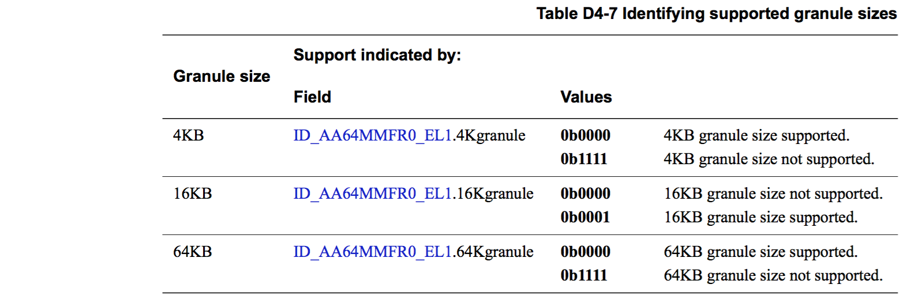
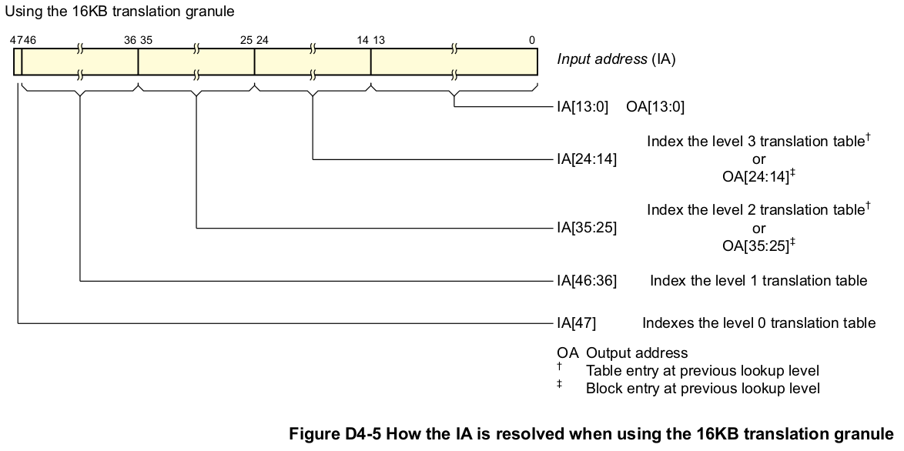
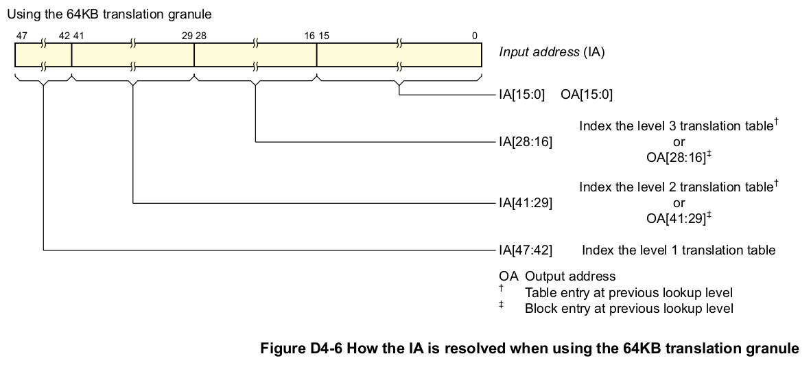
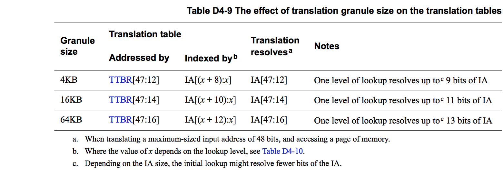
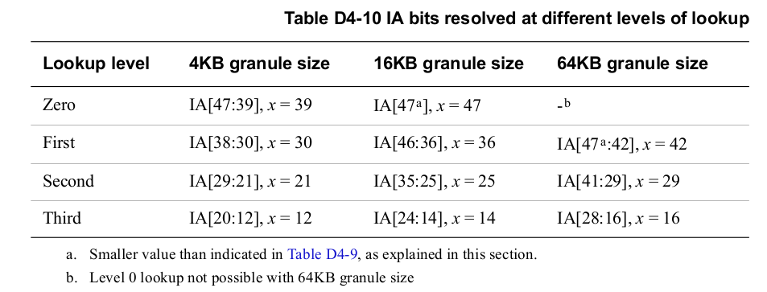

> ## D4.2.3 Memory translation granule size

## D4.2.3 Memory translation granule size

[`英文版`](../../en/chapter_d4/d42_3_memory_translation_granule_size.html)

Memory translation granule size 决定了以下两个参数：
* 单个 translation table 的最大 size
* Memory page size，即一次 translation table lookup 的粒度。

VMSAv8-64 支持 4KB、16KB 和 64KB 的 translation granule size。在具体实现中，并不要求实现所有的 granule size，Table D4-7 中描述了如何确定各个 granule size 是否支持。

VMSAv8-64 中的各个 address translation stage 可以单独配置 granule size。

> **NOTE:**
* 使用较大的 granule size 可以减少 address lookup 的次数，原因如下：
    - 增加了 translation table size 意味着 translation table 中有更多的条目，也意味着单次的 lookup 可以解析 input address 中更多的比特位。
    - 增加了 page size 意味着 input address 中更多的 least-significant 比特位可以直接映射到 output address 中，减少了需要进行 translation 的比特位。
* ARM 建议把 memory-mapped 的外设对齐到所支持的最大的 granule size，这样可以保证各个外设的独立管理。

Table D4-8 中汇总了不同 granule size 下的影响。

### How the granule size affects the address translation process

根据 Table D4-8 中的信息，可以看到，translation granule 决定了：
* 在一个 memory page 内寻址所需要的比特位
* 一次 translation table lookup 解析的比特位

这意味着 translation granule 决定了 translation 过程中 IA 是如何转换为 OA 的。  
由于单次的 translation table lookup 只能解析有限的位数，所以将 IA 转换为 OA 的过程中，需要进行多次 lookup。  
假定 IA 为 48 bits，translation granule size 为 2^n bytes：
* IA 的 least-significant n bits 为 memory page 内的偏移。也就是说，OA[(n-1):0]=IA[(n-1):0]。
* 剩下的 48 - n bits 需要进行 address translation 解析。
* translation table descriptor 大小为 8 bytes，因此：
    - 一个完整的 translation table 中保存了 2^(n-3) 个 descriptors
    - 一个 level 的 translation 最多可以解析 (n-3) 个地址位。
    (译者注：granule size 决定了一个 table 的 size，而 table 的 size 又决定了其能解析的地址比特数)  
    在整个 translation 过程中，最后一次的 lookup 解析 IA 最后的 least significant 比特位，由于一次 lookup 解析的比特位数为 (n-3)，所以可以得出以下结论：
        - 最后一次 lookup 解析的比特为 IA[(3n-7):(2n-3)]
        - 倒数第二次的 lookup 解析的比特为 IA[(3n-7):(2n-3)]  
    在具体实现中，IA 需要 translation 的比特位数并不一定是 (n-3) 的整数倍，第一次 lookup 解析的 most significant 比特位数可能小于 (n-3)，也就是所需要的 table 的也会比较小。因此，一次 lookup 能解析的比特位的通用公式如下：
        IA[Min(47, ((x-3)(n-3)+2n-4)):(n+(x-3)(n-3))]
    其中，

| | |
| -- | -- |
| Min(a, b) | 是一个返回 a 和 b 之间最小值的函数 |
| x | 为 lookup 的 level。translation 过程中的最后一个 lookup 定义为 level 3. |
    

The following diagrams show this model, for each of the permitted granule sizes.  
Figure D4-4 shows how a 48-bit IA is resolved when using the 4KB translation granule.

Figure D4-5 shows how a 48-bit IA is resolved when using the 16KB translation granule.

Figure D4-6 shows how a 48-bit IA is resolved when using the 64KB translation granule.

Later sections of this chapter give more information about the translation process, and explain the terminology used in these figures.

### Effect of granule size on translation table addressing and indexing

Table D4-9 shows the effect of the translation granule size on the addressing and indexing of the TTBR, and on the input address range that must be resolved.

Table D4-10 shows the IA bits resolved at each level of lookup, and how these correspond to the possible values of x in Table D4-9.

Table D4-9 refers to accessing a complete translation table, of 4KB, 16KB, or 64KB. However, the ARMv8 translation system supports the following possible variations from the information in Table D4-9:

#### Reduced IA width

根据具体实现和配置的不同，translation 过程中的第一次 lookup 所解析的 IA 的比特位可能会比后面几次 lookup 的少，也就是说，对于第一次 lookup：
* 其 translation table size 会比较小。第一次 lookup 解析的比特位每少一位，table size 就缩小一半。
> **NOTE:**
    - 第一次以后的 lookup 所对应的 translation table size 不会有影响。
    - 对于 stage 2 translation，可能会从较低 level 的 lookup 开始 translation。更多信息参考章节 [Concatenated translation tables on page D4-1655](#)。
* More low-order TTBR bits are needed to hold the translation table base address.(译者注：TTBR 中保存了 translation table base address，该 address 会对齐到 translation table size，因此在 table size 变化时，TTBR 中的 base address 的位数也会相应的变化)  

Example D4-1 中描述了 IA 为 35 bits，granule size 为 4KB 时的 translation 过程

**Example D4-1 Effect of an IA width of 35 bits when using the 4KB granule size**

---
当 granule size 配置为 4KB 时，单次的 lookup 最多可以解析 9 个比特位。假设在一个具体实现中，input address 有 35 位，即 IA[34:0]，根据 Table D4-10 中的描述，translation 从 level 1 lookup 开始，第一次 lookup 解析 IA[34:30]，即解析 5 个比特，对比后续的 lookup，少解析 4 个比特，也就意味着：
* 其对应的 translation table size 为 256B，是其他的 table size 的 1/(2^4)
* TTBR 指向第一次 lookup 的 translation table base address 为 TTBR[47:8]。(译者注：TTBR 中保存了 translation table base address，该 address 会对齐到 translation table size，因此在 table size 变化时，TTBR 中的 base address 的位数也会相应的变化)  
---

当 granule size 配置为 64KB，IA 为 48 位时，根据 Table D4-10 中的描述，translation 从 level 1 lookup 开始，并且该 lookup 只解析 IA[47:42] 6 个比特。level 1 lookup 对比在此配置下的其他 lookup 需要解析 13 个 IA 比特位，少解析了 7 个比特，也就意味着：
* 其对应的 translation table size 为 512B，是其他的 table size 的 1/(2^7)
* TTBR 指向第一次 lookup 的 translation table base address 为 TTBR[47:9]

#### Concatenated translation tables

(译者注：Concatenated translation tables 即为将多个小的 translation tables 串联合并成为一个更大的 translation table)

在 stage 2 address translation 的 initial lookup 中，最多可以将 16 个 translation tables 串联起来。串联起来后，由于 translation table 变大了，也就意味着 initial lookup 可以解析额外的 IA 的比特位。每增加 1 个比特的解析：
* 所需要的 translation table 的数量就翻倍。解析 n 个额外的 IA 比特，initial lookup 中就需要 2^n 个 translation table 串联起来。
* TTBR 中保存的 translation table base address 可以减少 1 位。

这就意味着 stage 2 translation 的 initial lookup 所解析的 IA 可以拓展多 4 个比特。Example D4-2 中描述了在 4KB translation granule 下，通过 translation table 串联来解析 40 比特的 IA。

**Example D4-2 Concatenating translation tables to resolve a 40-bit IA range, with the 4K granule**

---
Table D4-10 on page D4-1654 shows that, when using the 4KB translation granule, a level 1 lookup can resolve a 39-bit IA, with the first lookup resolving IA[38:30]. For a stage 2 translation, to extend the IA width to 40 bits and
resolve IA[39:30] with the first lookup:
* Two translation tables are concatenated, giving a total size of 8KB.
* The TTBR requires 1 fewer bit for the translation table base address, which becomes TTBR[47:13].
---

For more information, see [Concatenated translation tables for the initial stage 2 lookup on page D4-1671](#).

**Example D4-2 Concatenating translation tables to resolve a 40-bit IA range, with the 4K granule**

---
根据 Table D4-10 中的描述，当使用 4KB translation granule 时，从 level 1 lookup 开始，可以解析 39-bit 的 IA，其中 first lookup 解析 IA[39:30]。在 stage 2 translation 中，将 IA 拓展为 40 bits 时，first lookup 解析 IA[39:30]，此时需要：
* 将两个 translation tables 串联合并为一个 8KB 的 translation table
* TTBR 中保存的 translation table base address 由 TTBR[47:12] 变为 TTBR[47:13]。
---

> In all cases, the translation table, or block of concatenated translation tables, must be aligned to the actual size of the table or block of concatenated tables.
The translation table base address held in the TTBR is defined in the OA map for that stage of address translation.
The information given in this section assumes this stage of translation has an OA size of 48 bits, meaning the translation table base address is:
* TTBR[47:12] if using the 4KB translation granule.
* TTBR[47:14] if using the 16KB translation granule.
* TTBR[47:16] if using the 64KB translation granule.

> If the OA address is smaller than 48 bits then the upper bits of this field must be written as zero. For example, for a 40-bit OA range:
* If using the 4KB translation granule:
    - TTBR[47:40] must be set to zero.
    - TTBR[39:12] holds the translation table base address.
* If using the 16KB translation granule:
    - TTBR[47:40] must be set to zero.
    - TTBR[39:14] holds the translation table base address.
* If using the 64KB translation granule:
    - TTBR[47:40] must be set to zero.
    - TTBR[39:16] holds the translation table base address.

> In all cases, if TTBR[47:40] is not zero, any attempt to access the translation table generates an Address size fault.

translation table 以及串联合并后的 table 的地址必须对齐到实际的 table size。对于一个 address translation stage，TTBR 中保存着用于将 IA 映射到 OA 的 translation table 的 base address。

本小节后续内容将假定 translation stage 的 OA 为 48 bits，此时的 translation table base address 如下：
* 如果 translation granule 为  4KB，那么 base address 为 TTBR[47:12]
* 如果 translation granule 为 16KB，那么 base address 为 TTBR[47:14]
* 如果 translation granule 为 64KB，那么 base address 为 TTBR[47:16]

如果 OA 小于 48 bits，那么 OA 的高的 bits 需要设置为 0。例如，OA 为 40 bits 时：
* 如果 translation granule 为 4KB：
    - TTBR[47:40] 必须设为 0
    - TTBR[39:12] 保存 translation table base address
* 如果 translation granule 为 16KB：
    - TTBR[47:40] 必须设为 0
    - TTBR[39:14] 保存 translation table base address
* 如果 translation granule 为 64KB：
    - TTBR[47:40] 必须设为 0
    - TTBR[39:16] 保存 translation table base address

如果 OA 为 40 bits 时，TTBR[47:40] 没有设为 0，那么进行 address translation 时，就会触发 Address size fault。

