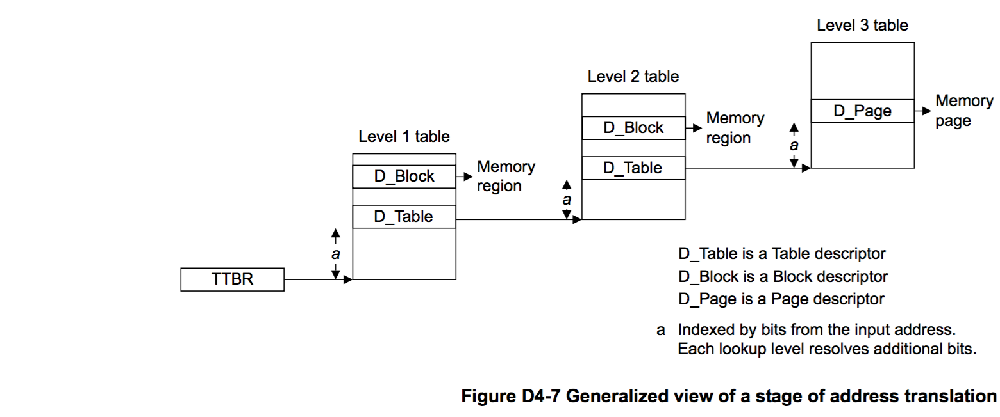

## D4.2.4 Translation tables and the translation process

## D4.2.4 Translation tables 和 the translation process

[`英文版`](../../en/chapter_d4/d42_4_translation_tables_and_the_translation_proces.html)

后续的几个小节主要介绍与 translation table format 无关的 translation tables 和 translation table walks 内容：
* [Translation table walks](#).
* [Security state of translation table lookups](#).
* [Control of translation table walks](#).
* [Security state of translation table lookups](#).

See also [Selection between TTBR0 and TTBR1 on page D4-1670](#) 章节.

### Translation table walks

一次 translation table walk 完成一次虚拟地址到物理地址的转换，它由一次或者多次 translation table lookup 组成。在 Non-secure EL1&0 translation regime 中，translation table walk 包含了stage 1 和 stage 2 转换中的 translation table lookup。Translation table walk 完成后，将会返回以下信息：
* 转换后的目的物理地址。如果进行转换的内存访问是在 Secure state 下发起的，那么还会包含转换后的目的物理地址是属于安全物理地址空间还是非安全物理地址空间这一信息。参考 [Security state of translation table lookups](#).
* 目的物理地址所在内存区块 (memory region) 的内存属性 (memory attributes)。更多内存属性相关的信息，可以参考 [Memory types and attributes](#) 和 [Memory region attributes](#) 章节。
* 目的物理地址所在内存区块的访问权限 (access permissions)。更多访问权限相关的信息，可以参考 [Memory access control](#) 章节。

一次 translation table walk 中的每次 translation table lookup 都是进行对应 translation table 的一次查表操作。其中第一个 lookup 的所查找的 translation table 的基地址保存在 TTBR 中，后续的 lookup 的 translation table 的基地址则由上一个 lookup 的查表结果提供。一次 translation table lookup 返回一个描述符 (descriptor)，该描述符包含以下的信息：
* 最后一次 lookup 所返回的描述符包含 OA 以及此次内存访问的权限和属性信息。
* 非最后一次 lookup 所返回的描述符包含下一次 lookup 所对应的 translation table 的基地址，另外还包含以下的信息：
    - 层级属性信息，更多相介绍可以参考 [Hierarchical control of Secure or Non-secure memory accesses](#) 和 [Hierarchical control of data access permissions](#) 章节。
    - 如果此次 translation 是属于 Secure translation regime，那么描述符会包含 translation table 的基地址是属于 Secure 还是 Non-secure 地址空间这一信息。如果此次 translation 不属于 Secure translation regime 那么上一次的 lookup 结果就已经决定了此次 lookup 得到的 translation table 的基地主必然是属于 Non-secure 地址空间。
* 如果描述符是一个非法描述符，那么此次内存访问就会产生一个 Translation fualt。

Figure D4-7 描述了 1 个 stage，包含三次 lookup 的地址转换过程。

A translation table lookup from VMSAv8-64 performs a single-copy atomic 64-bit access to the translation table entry. This means the translation table entry is treated as a 64-bit object for the purpose of endianness. SCTLR.EE determines the endianness of the translation table lookups.

> **NOTE:**
**Dynamically changing translation table endianness**
Because any change to an SCTLR.EE, bit requires synchronization before it is visible to subsequent operations, ARM strongly recommends that any EE bit is changed only when either:  
* Executing at an Exception level that does not use the translation tables affected by the EE bit being changed.
* Executing with address translation disabled for any stage of translation affected by the EE bit being changed.
Address translation stages are disabled by setting an SCTLR.M bit to 0. See the appropriate register description for more information.

(TODO：此处关于 endianness 的相关描述不理解)

The appropriate TTBR holds the output address of the base of the translation table used for the initial lookup, and:
第一次 lookup 的 translation table 的基地址保存在相应的 TTBR 中，另外：

* 除了 Non-secure EL1&0 stage 1 以外的其他 stage 的地址转换中，保存在 TTBR 和 lookup 返回的描述符中的 translation table 的基地址都是物理地址。
* 在 Non-secure EL1&0 stage 1 的地址转换中，保存在 TTBR 和 lookup 返回的描述符中的 translation table 的基地址则是 IPA。也就是，如果使能了 stage 2 的地址转换，这些返回的基地址的实际物理地址还要经过 stage 2 的地址转换才能得到。(原句：This means that if stage 2 address translation is enabled, each of these OAs is subject to second stage translation.)

    > **NOTE:**  
    TLB 缓冲机制可以减少完成地址转换所需要执行的 lookup 次数。由于 stage 1 中 lookup 返回的基地址还需要进行 stage 2 的转换才能得到实际的物理地址，所以，如果 TLB 中缓存的 translation table entries 是无效的，那么完成转换所需的 lookup 次数会成倍增长。完成转换所需的 lookup 次数的计算公式如下：

    > (S1+1)*(S2+1) - 1
    
    > 其中，S1 是完成 stage 1 的转换所需要的 lookup 次数，S2 是完成 stage 2 的转换所需要的次数。

The TTBR also determines the memory cacheability and shareability attributes that apply, for that stage of translation, to all translation table lookups generated by that stage of translation.

TTBR 中还决定了一个 stage 的地址转换中的所有 translation table lookup 的 memory cacheability 和 shareability 属性。

同时，translation table lookup 的 memory type 为 Normal memory type。

> **NOTE:**
* In a two stage translation system, a translation table lookup from stage 1, that has the Normal memory type defined at stage 1 by this rule, can still be given the Device memory type as part of the stage 2 translation of that address. ARM strongly recommends against such a remapping of the memory type, and the architecture includes a trap of this behavior to EL2. For more information, see Stage 2 fault on a stage 1 translation table walk on page D4-1726.
* The rules about mismatched attributes given in [Mismatched memory attributes on page B2-104](#) apply to the relationship between translation table walks and explicit memory accesses to the translation tables in the same way that they apply to the relationship between different explicit memory accesses to the same location. For this reason, ARM strongly recommends that the attributes that the TTBR applies to the translation tables are the same as the attributes that are applied for explicit accesses to the memory that holds the translation tables.

For more information see Overview of the VMSAv8-64 address translation stages. See also [Selection between TTBR0 and TTBR1 on page D4-1670](#).

#### Security state of translation table lookups

For a Non-secure translation regime, all translation table lookups are performed to Non-secure output addresses.

For a Secure translation regimes, the initial translation table lookup is performed to a Secure output address.

If the translation table descriptor returned as a result of that initial lookup points to a second translation table, then the NSTable bit in that descriptor determines whether that translation table lookup is made to Secure or to Non-secure output addresses.

This applies for all subsequent translation table lookups as part of that translation table walk, with the additional rule that any translation table descriptor that is returned from Non-secure memory is treated as if the NSTable bit in that descriptor indicates that the subsequent translation table lookup is to Non-secure memory.

#### Control of translation table walks

For the first stage of the EL1&0 translation regime, the TCR_EL1.{EPD0, EPD1} bits determine whether the translation tables for that regime are valid. EPD0 indicates whether the table that TTBR0_EL1 points to is valid, and EPD1 indicates whether the table that TTBR1_EL1 points to is valid. The effect of these bits is:

| | |
| -- | -- |
| EPDn == 0 | The translation table is valid, and can be used for a translation table lookup. |
| EPDn == 1 | If a TLB miss occurs based on TTBRn, a Translation fault is returned, and no translation table walk is performed. The fault is reported as a level 0 fault. |

