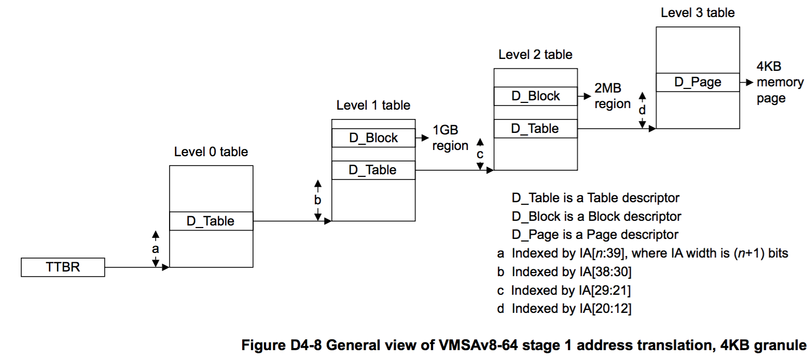
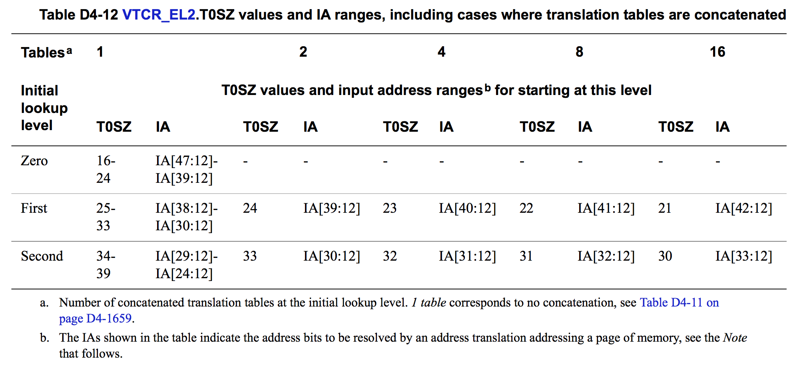
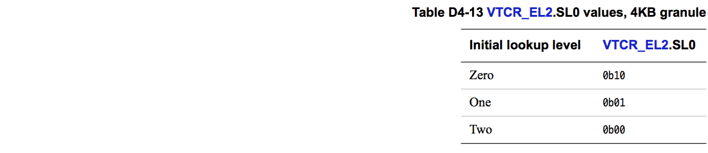
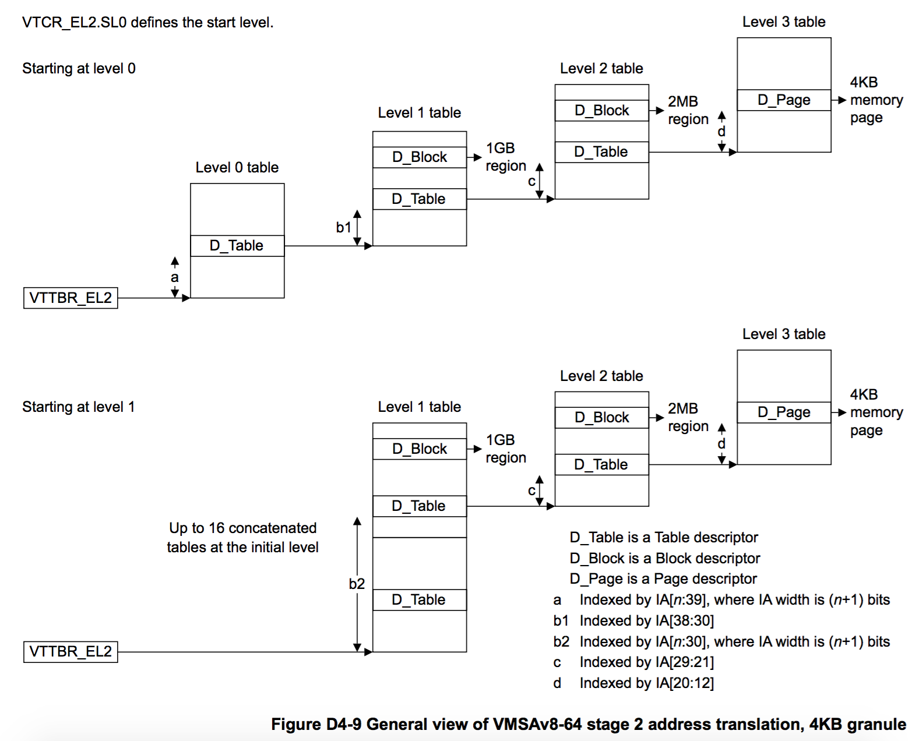
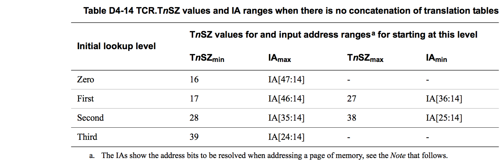
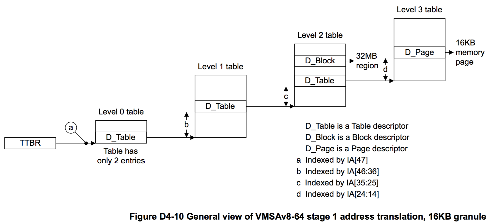
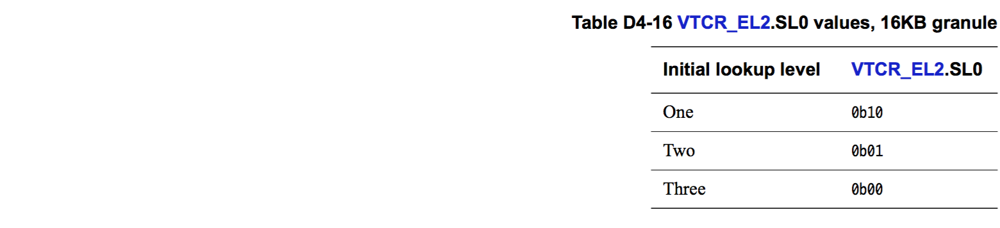
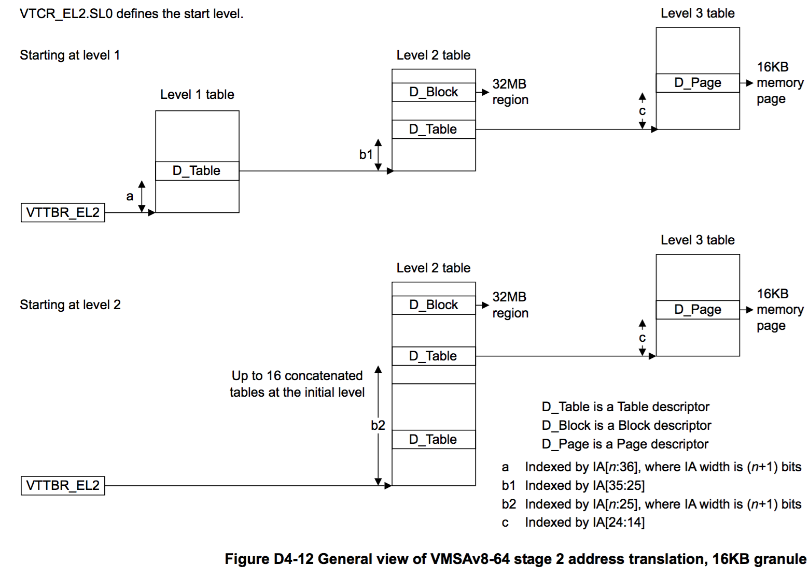
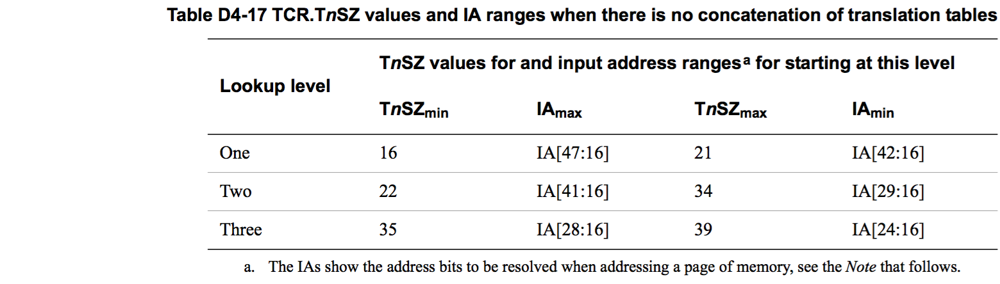
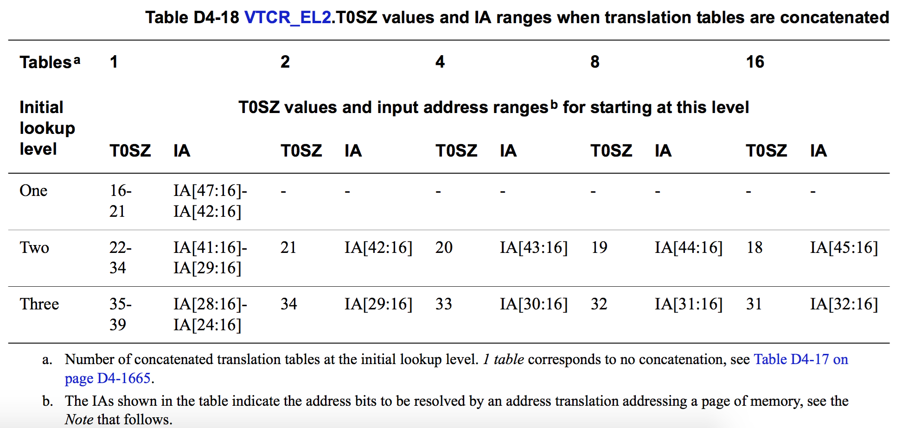

## D4.2.5 Overview of the VMSAv8-64 address translation stages

[Memory translation granule size](#) 章节介绍了不同的 granule size 对地址转换过程中的影响。[Effect of granule size on translation table addressing and indexing on page D4-1654](#) 章节则介绍了，各个 granule size 下：
* 输入地址的范围与第一次 lookup 所在 level 的关系。
* stage 2 转换过程中的 [Concatenated translation tables](#)。
* TTBR 中第一次 lookup 的 translation table 的基地址的存储方式。

本小节中，将汇总不同 granule size 对地址转换过程中的 1 个 stage 中的 lookup 的影响，主要包括以下内容：

* [Overview of VMSAv8-64 address translation using the 4KB translation granule on page D4-1659](#)。 
* [Overview of VMSAv8-64 address translation using the 16KB translation granule on page D4-1662](#)。 
* [Overview of VMSAv8-64 address translation using the 64KB translation granule on page D4-1665](#)。 

### Overview of VMSAv8-64 address translation using the 4KB translation granule

stage 1 和 stage 2 的地址转换的第一次 lookup 所在的 level 有所差异。

#### Overview of stage 1 translations, 4KB granule

在 stage 1 地址转换中，第一次 lookup 所在的 level 由 TCR.TxSZ 寄存器位所设定的输入地址范围唯一决定。在使用 4KB granule 时，具体的关系如 Table D4-11 所示：

上面的配置关系对于 stage 2 的地址转换同样适用。

> **NOTE:**  
* 当使用 4KB translation granule 时，第一次 lookup 不会在 level 3。
* IA 的一些地址位不需要通过 translation table lookup 来解析，它们是直接映射到 OA 中，使用 4KB translation granule 时的所有转换中 IA[11:0] = OA[11:0]。

Figure D4-8 中描述了使用 4KB translation granule、输入地址大于 39 位时的 stage 1 地址转换过程。 

#### Overview of stage 2 translations, 4KB granule

在 stage 2 地址转换中，第一次 lookup 的 translation table 最多可以由 16 个 translation table 连接起来 (译者注：连接的 table 越多，第一次 lookup 可以解析的地址位就越多，进而可以减少一次 translation 所需要的 lookup 次数，加快 translation 的速度)。 在输入地址大小一定的条件下，连接更多的 table 意味着第一次 lookup 可以在更低的 level 开始。更多信息可以参考 [Concatenated translation tables for the initial stage 2 lookup](#) 章节。

Table D4-12 描述了使用 4KB translation granule 时，stage 2 地址转换的第一次 lookup 的所有可能的配置：

> **NOTE: **  
* 当使用 4KB translation granule 时，第一次 lookup 不会在 level 3。
* 当使用 4KB translation granule 时，如果使用了 table 连接作为第一次 lookup 的 table，那么第一次 lookup 不会在 level 0。(译者注：使用 table 连接后，第一次 lookup 解析的地址为增加了，相应的也可以减少整个地址转换所需要执行的 lookup 次数)
* IA 的一些地址位不需要通过 translation table lookup 来解析，它们是直接映射到 OA 中，使用 4KB translation granule 时的所有转换中 IA[11:0] = OA[11:0]。

另外，VTCR_EL2.SL0 寄存器位指示了第一次 lookup 所在的 level。如 Table D4-13 所示：

由于最多可以将 16 个 table 连接作为第一次 lookup 的 table，所以 VTCR_EL2.{T0SZ, SL0} 两个寄存器位的合法值需要相互匹配并满足一定的条件。在 translation table walk 开始时，如果发现 T0SZ 和 SL0 不匹配，那么就会产生一个 stage 2 level 0 translation fault。

Figure D4-9 描述了 stage 2 的地址转换。对于 40 至 43 位的输入地址，第一次 lookup 所在的 level 可能是 0，也可能是 1。

### Overview of VMSAv8-64 address translation using the 16KB translation granule

stage 1 和 stage 2 的地址转换的第一次 lookup 所在的 level 有所差异。

#### Overview of stage 1 translations, 16KB granule

在 stage 1 地址转换中，第一次 lookup 所在的 level 由 TCR.TxSZ 寄存器位所设定的输入地址范围唯一决定。在使用 16KB granule 时，具体的关系如 Table D4-11 所示：

在 stage 2 地址转换中，不能设定第一次 lookup 所在的 level 为 level 0，其他 level 的设定则与 stage 1 一样。

> **NOTE:**  
* 当使用 16KB translation granule 时，处于 level 0 的 lookup 操作只能解析 1 个地址位。
* IA 的一些地址位不需要通过 translation table lookup 来解析，它们是直接映射到 OA 中，使用 16KB translation granule 时的所有转换中 IA[13:0] = OA[13:0]。

Figure D4-10 中描述了使用 16KB translation granule、输入地址为 48 位时的 stage 1 地址转换过程。 

#### Overview of stage 2 translations, 16KB granule

在 stage 2 地址转换中，第一次 lookup 的 translation table 最多可以由 16 个 translation table 连接起来。在输入地址大小一定的条件下，连接更多的 table 意味着第一次 lookup 可以在更低的 level 开始。更多信息可以参考 [Concatenated translation tables for the initial stage 2 lookup](#) 章节。

当使用 16KB granule 时，在 stage 2 translation 中，如果输入地址为 48 位，那么第一次 lookup 必须在 level 1，并且其 translation table 为 2 个 table 连接起来的。

Table D4-15 描述了使用 16KB translation granule 时，stage 2 地址转换的第一次 lookup 的所有可能的配置：

> **NOTE:**  
* 当使用 16KB granule 时，在 stage 2 translation 中，第一次 lookup 不会在 level 0。另外，如果输入地址为 48 位，那么第一次 lookup 必须在 level 1，并且其 translation table 为 2 个 table 连接起来的。
* IA 的一些地址位不需要通过 translation table lookup 来解析，它们是直接映射到 OA 中，使用 4KB translation granule 时的所有转换中 IA[11:0] = OA[11:0]。

此外，VTCR_EL2.SL0 寄存器位指示了第一次 lookup 所在的 level。如 Table D4-16 所示：

由于最多可以将 16 个 table 连接作为第一次 lookup 的 table，所以 VTCR_EL2.{T0SZ, SL0} 两个寄存器位的合法值需要相互匹配并满足一定的条件。在 translation table walk 开始时，如果发现 T0SZ 和 SL0 不匹配，那么就会产生一个 stage 2 level 0 translation fault。

如果 stage 2 translation 的输入地址为 48 位，那么第一次 lookup 必须在 level 1，并且其 translation table 为 2 个 table 连接起来的。Figure D4-11 描述了此种条件下的转换过程。

对于位数在 37 至 40 之间的输入地址，第一次 lookup 可以在 level 1 或者 level 2。Figure D4-12 描述了此种条件下的转换过程。

### Overview of VMSAv8-64 address translation using the 64KB translation granule

stage 1 和 stage 2 的地址转换的第一次 lookup 所在的 level 有所差异。

#### Overview of stage 1 translations, 64KB granule

For a stage 1 translation, the required initial lookup level is determined only by the required input address range specified by the corresponding TCR.TxSZ field. When using the 64KB translation granule, Table D4-17 shows this requirement.

在 stage 1 地址转换中，第一次 lookup 所在的 level 由 TCR.TxSZ 寄存器位所设定的输入地址范围唯一决定。在使用 64KB granule 时，具体的关系如 Table D4-17 所示：

上面的配置关系对于 stage 2 的地址转换同样适用。

> **NOTE:**
* When using the 64KB translation granule, there are no level 0 lookups.
* 当使用 64KB translation granule 时，不支持任何 level 0 上的 lookup。
* Some bits of the IA do not require resolution by the translation table lookup, because they always map directly to the OA. When using the 64KB translation granule, IA[15:0] = OA[15:0] for all translations.

Figure D4-13 shows the stage 1 address translation, for an address translation using the 64KB granule with a an input address size greater than 42 bits.

#### Overview of stage 2 translations, 64KB granule

For a stage 2 translation, up to 16 translation tables can be concatenated at the initial lookup level. For certain input address sizes, concatenating tables in this way means that the lookup starts at a lower level than would otherwise be the case. For more information see Concatenated translation tables for the initial stage 2 lookup on page D4-1671.
When using the 64KB translation granule, Table D4-18 shows all possibilities for the initial lookup for a stage 2 translation.

> **NOTE:**

* When using the 64KB translation granule, there are no level 0 lookups.
* Because concatenating translation tables reduces the number of levels of lookup required, when using the 64KB translation granule, tables cannot be concatenated at level 1.
* Some bits of the IA do not require resolution by the translation table lookup, because they always map directly to the OA. When using the 64KB translation granule, IA[15:0] = OA[15:0] for all translations.

VTCR_EL2.SL0 indicates the required initial lookup level, as Table D4-19 shows.

Because the maximum number of concatenated translation tables is 16, there is a relationship between the permitted VTCR_EL2.{T0SZ, SL0} values. If, when a translation table walk is started, the T0SZ value is not consistent with the SL0 value, a stage 2 level 0 translation fault is generated.

Figure D4-14 shows the stage 2 address translation, for an input address size of between 43 and 46 bits. This means the lookup can start at either level 1 or level 2.

