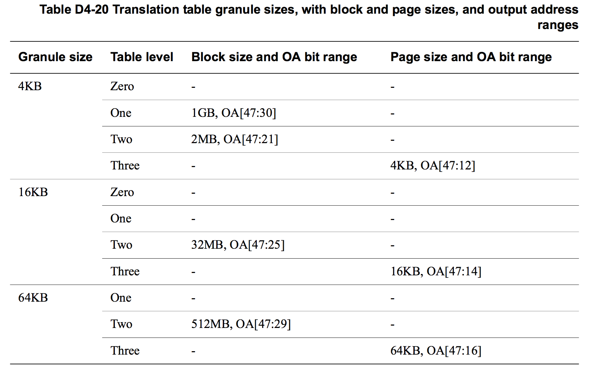
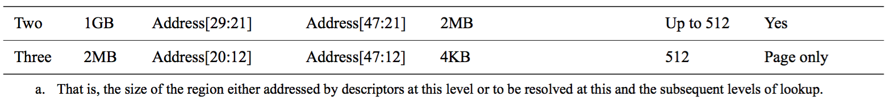
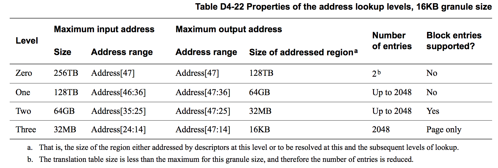
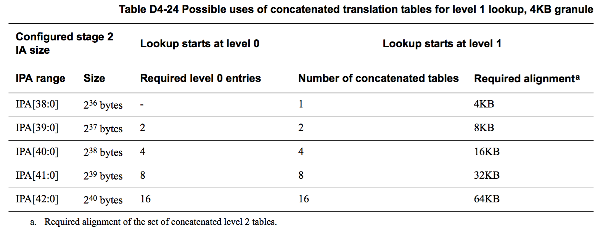

## D4.2.6 The VMSAv8-64 translation table format

本小节主要描述 VMSAv8-64 中地址转换过程中所使用的 translation table 的格式。

对于 AArch64 运行态下的一个 Exception level 中的地址转换过程：

* TCR_EL1.{SH0, ORGN0, IRGN0, SH1, ORGN1, IRGN1} 寄存器位定义了使用 TTBR0_EL1 和 TTBR1_EL1 的 translation table walk 的所访问的内存属性。
* 在 Secure 和 Non-secure EL1&0 的 stage 1 translation 中，TTBR0_EL1 和 TTBR1_EL1 都包含 ASID (Address Space Identifier) 位，而 TCR_EL1.A1 寄存器位则用于设定使用哪一个 ASID。(The architecture supports the use of an address space identifier (ASID) to allow the operating system to identify one process' address space from another's without flushing the TLB.) 

对于 translation table 的格式，在 [Overview of the VMSAv8-64 address translation stages](#) 章节中已经汇总了 lookup level 相关的信息，而在[Descriptor encodings, ARMv8 level 0, level 1, and level 2 formats](#) 章节中则介绍了 translation table entry 的相关内容。

本章节主要介绍以下几个方面的内容：

* [Translation granule size and associate block and page sizes](#).
* [Selection between TTBR0 and TTBR1](#).
* [Concatenated translation tables for the initial stage 2 lookup](#).
* [Possible translation table registers programming errors](#).

### Translation granule size and associate block and page sizes

Table D4-20 描述了在输出地址为 48 位时，不同 granule size 下的 block size 和 page size。

Translation table 中的 descriptor 的 bit[1] 用于指示该 descriptor 是否为 block descriptor，另外：

* 使用 4KB granule size 时，只有在 level 1 和 2 的 translation table 中支持 block descriptor。
* 使用 16KB 和 64KB granule size 时，只有在 level 2 的 Translation table 支持  block descriptor。

(进行地址转换时，遇到 block descriptor 就表示转换结束了，并且未解析的 IA 地址位作为 block 内的偏移，直接赋值给 OA。实际应用中可以为特定的需求分配一个 block 的内存，这个内存的地址转换相对于 page 会有更高的效率)

如果将不支持 block descriptor 的 translation table 中的 descriptor 的 bit[1] 设为 0，将会触发 Translation fault。

后续的几个表格中，描述了在 AArch64 运行态下的 translation 的各个 level 下 的 lookup 在不同 granule size 下的相关信息，包括：
* 所支持的最大的 IA 大小，以及在该 IA 大小下，该 level 的 lookup 所解析的地址位。
* 该 level 上的 translation table descriptor 所转换能的最大的 OA 范围，以及其所对应的 memory region 大小。
* 解析最大 IA 所需要的 translation table 的大小。

对于第一次 lookup 所在的 level：

* TCR.TxSZ 寄存器位所设定的 IA 范围小于上面表格中的最大值时，translation table 中保存的 descriptor 也会小于最大值，相应的 translation table 的大小也会变小。
* 对于 stage 2 translation，由于可以进行 translation table 的连接操作，其解析的 IA 大小可以超过上面表格中的值。更多的信息可以参考 [Overview of the VMSAv8-64 address translation stages](#) and [Concatenated translation tables for the initial stage 2 lookup](#) 章节。

如果给出的输入地址大于所配置的大小，那么就会触发 Translation fault。

> **NOTE:**  
对于特定大小的虚拟地址，如果使用较大的 granule size，相对于使用较小的 granule size 可以较少解析地址所需要的 lookup 次数。

关于 TCR 寄存器中对 initial lookup 的配置，可以参考 [Overview of the VMSAv8-64 address translation stages](#) 章节。

### Selection between TTBR0 and TTBR1

Every translation table walk starts by accessing the translation table addressed by the TTBR for the stage 1 translation for the required translation regime.
For the EL1&0 translation regime, the VA range is split into two subranges as shown in Figure D4-15, and:

在 translation regime 的 stage 1 translation 中，translation table walk 第一个访问的 translation table 的地址都是从 TTBR 中得到的。在 EL1&0 translation regime 中， VA 被分割为两个 range，在这种场景下：

* 从 0x0000_0000_0000_0000 开始的 VA range 的 initial translation table 的基地址保存在 TTBR0_EL1 中。
* 以 0xFFFF_FFFF_FFFF_FFFF 结束的 VA range 的 initial translation table 的基地址保存在 TTBR1_EL1 中。

Which TTBR is used depends only on the VA presented for translation:
* If the top bits of the VA are zero, then TTBR0_EL1 is used.
* If the top bits of the VA are one, then TTBR1_EL1 is used.

在 translation 中，最终决定使用哪一个 TTBR 的，是需要进行转换的 VA：

* 如果 VA 的 top bits 都为 0，那么将使用 TTBR0_EL1
* 如果 VA 的 top bits 都为 1，那么将使用 TTBR1_EL1

It is configurable whether this determination depends on the values of VA[63:56] or on the values of VA[55:48], see [Address tagging in AArch64 state on page D4-1638](#).

> **NOTE:**  
The handling of the Contiguous bit can mean that the boundary between the translation regions defined by the TCR_EL1.TnSZ values and the region for which an access generates a Translation fault is wider than shown in Figure D4-15. That is, if the descriptor for an access to the region shown as generating a fault has the Contiguous bit set to 1, the access might not generate a fault. [Possible translation table registers programming errors on page D4-1673](#) describes this possibility.

Example D4-3 on page D4-1671 shows a typical application of this VA split.

Example D4-3 Example use of the split VA range, and the TTBR0_EL1 and TTBR1_EL1 controls

---

**TTBR0_EL1**  
Used for process-specific addresses.
Each process maintains a separate level 1 translation table. On a context switch:
* TTBR0_EL1 is updated to point to the level 1 translation table for the new context
* TCR_EL1 is updated if this change changes the size of the translation table
* CONTEXTIDR_EL1 is updated.

**TTBR1_EL1**  
Used for operating system and I/O addresses, that do not change on a context switch.

---

For each VA subrange, the input address size is 2(64-TnSZ), where TnSZ is one of TCR_EL1.{T0SZ, T1SZ}, This means the two VA subranges are:

**Lower VA subrange** 0x0000_0000_0000_0000 to (2(64-T0SZ) - 1).

**Upper VA subrange** (264 - 2(64-T1SZ)) to 0xFFFF_FFFF_FFFF_FFFF.

The minimum TnSZ value is 16, corresponding to the maximum input address range of 48 bits. Example D4-4 shows the two VA subranges when T0SZ and T1SZ are both set to this minimum value.

Example D4-4 Maximum VA ranges for EL1&0 stage 1 translations

---

The maximum VA subranges correspond to T0SZ and T1SZ each having the minimum value of 16. In this case the subranges are:

**Lower VA subrange** 0x0000_0000_0000_0000 to 0x0000_FFFF_FFFF_FFFF. 

**Upper VA subrange** 0xFFFF_0000_0000_0000 to 0xFFFF_FFFF_FFFF_FFFF.

---

Figure D4-15 on page D4-1670 indicates the effect of varying the TnSZ values.

As described in [Overview of the VMSAv8-64 address translation stages on page D4-1658](#), the TnSZ values also determine the initial lookup level for the translation.

### Concatenated translation tables for the initial stage 2 lookup

[Overview of the VMSAv8-64 address translation stages on page D4-1658](#) introduced the ability to concatenate translation tables for the initial stage 2 translation lookup. This section gives more information about that concatenation.

Where a stage 2 translation would require 16 entries or fewer in its top-level translation table, the system designer can instead:
* Require the corresponding number of concatenated translation tables at the next translation level, aligned to the size of the block of concatenated translation tables.
* Start the translation at that next translation level.

In addition, when using the 16KB translation granule and requiring a 48-bit input address size for the stage 2 translations, lookup must start with two concatenated translation tables at level 1.

> **NOTE:**  
This translation scheme:
* Avoids the overhead of an additional level of translation.
* Requires the software that is defining the translation to:
    - Define the concatenated translation tables with the required overall alignment.
    - Program VTTBR_EL2 to hold the address of the first of the concatenated translation tables.
    - Program VTCR_EL2 to indicate the required input address range and initial lookup level.
    

Concatenating additional translation tables at the initial level of look up resolves additional address bits at that level. To resolve n additional address bits requires 2n concatenated translation tables. Example D4-5 shows how, for level 1 lookups using the 4KB translation granule, translation tables can be concatenated to resolve three additional address bits.

Example D4-5 Adding three bits of address resolution at level 1 lookup, using the 4KB granule

---

When using the 4KB translation granule, a level1 lookup with a single translation table resolves address bits[38:30]. To add three more address bits requires 23 translation tables, that is, eight translation tables. This means:
* The total size of the concatenated translation tables is 8 × 4KB = 32KB.
* This block of concatenated translation tables must be aligned to 32KB.
* The address range resolved at this lookup level is A[41:30].of which:
    - Bits A[41:39] select the 4KB translation table.
    - Bits A[38:30] index a descriptor within that translation table.

---

As an example of the concatenation of translation tables at the initial lookup level, when using the 4KB translation granule, Table D4-24 shows the possible uses of concatenated translation tables to permit lookup to start at level 1 rather than at level 0. For completeness, the table starts with the case where the required IPA range means lookup starts at level 1with a single translation table at that level.

> **NOTE:**  
Because concatenation is permitted only for a stage 2 translation, the input addresses in the table are IPAs.

[Overview of the VMSAv8-64 address translation stages on page D4-1658](#) identifies all of the possible uses of concatenation. In all cases, the block of concatenated translation tables must be aligned to the block size.

### Possible translation table registers programming errors

This subsection describes possible errors in programming the translation table registers.

#### Misprogramming the VTCR_EL2.{T0SZ, SL0} fields

For a stage 2 translation, the programming of the VTCR_EL2.{T0SZ, SL0} fields must be consistent, see [Overview of the VMSAv8-64 address translation stages on page D4-1658](#).

#### Misprogramming of the Contiguous bit
For more information about the Contiguous bit, and the range of translation table entries that must have the bit set to 1 to mark the entries as contiguous, see [The Contiguous bit on page D4-1715](#).

If one or more of the following errors is made in programming the translation tables, the TLB might contain overlapping entries:

* One or more of the contiguous translation table entries does not have the Contiguous bit set to 1.
* One or more of the contiguous translation table entries holds an output address that is not consistent with all of the entries pointing to the same aligned contiguous address range.
* The attributes and permissions of the contiguous entries are not all the same.

Such misprogramming of the translation tables means the output address, memory permissions, or attributes for a lookup might be corrupted, and might be equal to values that are not consistent with any of the programmed translation table values.

In some implementations, such misprogramming might also give rise to a TLB Conflict abort.

The architecture guarantees that misprogramming of the Contiguous bit cannot provide a mechanism for any of the following to occur:

* Software executing at EL1 or EL0 accessing regions of physical memory that are not accessible by programming the translation tables, from EL1, with arbitrary chosen values that do not misprogram the Contiguous bit.
* Software executing at EL1 or EL0 accessing regions of physical memory with attributes or permissions that are not possible by programming the translation tables, from EL1, with arbitrary chosen values that do not misprogram the Contiguous bit.
* Software executing in Non-secure state accessing Secure physical memory.

> **NOTE:**  
Hardware implementations must ensure that use of the Contiguous bit cannot provide a mechanism for avoiding output address range checking. This might occur if a Contiguous bit block size of 0.5GB or 1GB is used in a system with the output address size configured to 4GB. The architecture permits the implemented mechanism for preventing any avoidance of output address range checking to suppress the use of the Contiguous bit for such entries in such a system.

Where the Contiguous bit is used to mark a set of blocks as contiguous, if the address range translated by a set of blocks marked as contiguous is larger than the size of the input address supported at a stage of translation used to translate that address at that stage of translation, as defined by the TCR.TxSZ field, then this is a programming error. An implementation is permitted, but not required, to:

* Treat such a block within a contiguous set of blocks as causing a Translation fault, even though the block is valid, and the address accessed within that block is within the size of the input address supported at a stage of translation, as defined by the TCR.TxSZ field.
* Treat such a block within a contiguous set of blocks as not causing a Translation fault, even though the address accessed within that block is outside the size of the input address supported at a stage of translation, as defined by the TCR.TxSZ field, provided that both of the following apply:
    - The block is valid.
    - At least one address within the block, or contiguous set of blocks, is within the size of the input address supported at a stage of translation.