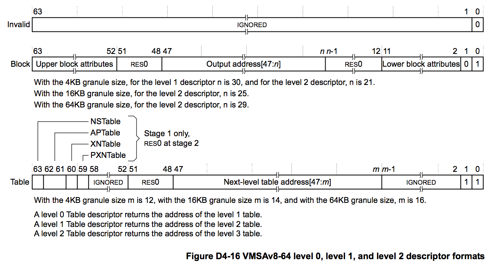

## D4.3.1 VMSAv8-64 translation table level 0 level 1 and level 2 descriptor formats

在 VMSAv8-64 的 level 0、level 1 和 level 2 的 translation table descriptor 的格式主要存在以下的差异：
* 是否存在 block entry。
* block entry 所执行的内存块的大小。

在不同的 translation granule 下，不同 level 的差异如下：  
**4KB granule**  
Level 0 descriptor 不支持 block translation。
Block entry：
* 在 level 1 table 中，映射 1GB 的 input address range
* 在 level 2 table 中，映射 2MB 的 input address range

**16KB granule** 
Level 0 和 level 1 descriptors 都不支持 block translation
在 Level 2 table 中，block entry 映射 32MB 的 input address range

**64KB granule**  
不支持 Level 0 lookup 操作。
Level 1 descriptor 不支持 block translation
在 Level 2 table 中，block entry 映射 512MB 的 input address range

[Figure D4-16](#) 描述了 ARMv8 level 0, level 1, and level 2 descriptor 格式:

### Descriptor encodings, ARMv8 level 0, level 1, and level 2 formats

Descriptor 的 bit[0] 指明该 descriptor 是否有效，该 bit 为 1 时，为有效的 descriptor。如果一次 lookup 操作返回一个无效的 descriptor，那么就意味着该 input address 没有进行映射，当访问该 input address 时，会产生 Translation fault。  

Descriptor 的 bit[1] 指明该 descriptor 的类型，如下表所示：

||||
| -- | -- | -- |
| **0** | **Block** | Descriptor 包含了一个内存块的基地址和属性。 |
| **1** | **Table** | Descriptor 包含了下一级 translation table 的基地址，在 stage 1 translation 中，还包含对应的 translation 的属性信息。|

有效的 descriptor 中的其他比特位的含义如下：

**Block descriptor**  
Gives the base address and attributes of a block of memory, as follows:  
包含一个 memory block 的基地址和属性信息，如下：

**4KB translation granule**  
* 在 level 1 Block descriptor 中，bits[47:30] 为 output address 的 bits[47:30]。此 output address 指向一个 1GB 的 memory block。
* 在 level 2 Block descriptor 中，bits[47:21] 为 output address 的 bits[47:21]。此 output address 指向一个 2MB 的 memory block。

**16KB translation granule**  
* 在 level 2 Block descriptor 中，bits[47:25] 为 output address 的 bits[47:25]。此 output address 指向一个 32MB 的 memory block。  

**64KB translation granule**  
* 在 level 2 Block descriptor 中，bits[47:29] 为 output address 的 bits[47:29]。此 output address 指向一个 512MB 的 memory block。  

Bits[63:52, 11:2] 包含该 memory block 的属性信息，更多属性相关内容可以参考 [Memory attribute fields in the VMSAv8-64 translation table format descriptors ](#)章节。Level 2 block descriptor 和 level 3 page descriptor 中的 Bits[63:52, 11:2] 含义是相同的。

**Table descriptor**  
包含下一级 translation table 的基地址，如下：

**4KB translation granule**  
* bits[47:12] 为 output address 的 bits[47:12]，同时：
  - 在 level 0 Table descriptor 中, output address 为 level 1 table 的基地址。
  - 在 level 1 Table descriptor 中, output address 为 level 2 table 的基地址
  - 在 level 2 Table descriptor 中, output address 为 level 3 table 的基地址
* 基地址的 Bits[11:0] 为 0.

**16KB translation granule**  
* bits[47:14] 为 output address 的 bits[47:14]，同时：
  - 在 level 0 Table descriptor 中, output address 为 level 1 table 的基地址。
  - 在 level 1 Table descriptor 中, output address 为 level 2 table 的基地址
  - 在 level 2 Table descriptor 中, output address 为 level 3 table 的基地址
* 基地址的 Bits[13:0] 为 0.

**64KB translation granule**
* Bits[47:16] are bits[47:16] of the address of the required next-level table, which is:
   - For a level 1 Table descriptor, the address of a level 2 table.
   - For a level 2 Table descriptor, the address of a level 3 table.
* Bits[15:0] of the table address are zero.
* bits[47:16] 为 output address 的 bits[47:16]，同时：
  - 在 level 1 Table descriptor 中, output address 为 level 2 table 的基地址
  - 在 level 2 Table descriptor 中, output address 为 level 3 table 的基地址
* 基地址的 Bits[13:0] 为 0.

For a stage 1 translation only, bits[63:59] provide attributes for the next-level lookup, see Memory attribute fields in the VMSAv8-64 translation table format descriptors on page D4-1699.

If the translation table defines the Non-secure EL1&0 stage 1 translations, then the output address in the descriptor is the IPA of the target block or table. Otherwise, it is the PA of the target block or table.