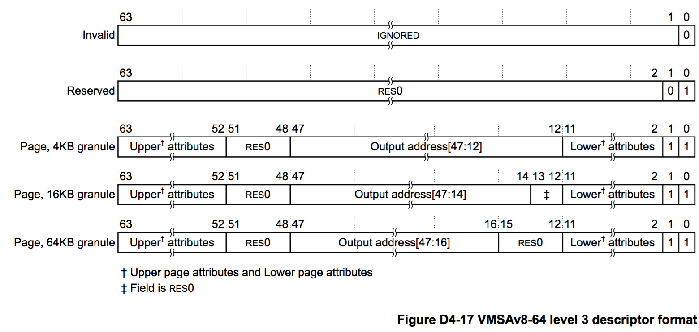

## D4.3.2 ARMv8 translation table level 3 descriptor formats

For the 4KB granule size, each entry in a level 3 table describes the mapping of the associated 4KB input address range.  
For the 16KB granule size, each entry in a level 3 table describes the mapping of the associated 16KB input address range.  
For the 64KB granule size, each entry in a level 3 table describes the mapping of the associated 64KB input address range.  
Figure D4-17 shows the ARMv8 level 3 descriptor formats.

Descriptor bit[0] identifies whether the descriptor is valid, and is 1 for a valid descriptor. If a lookup returns an invalid descriptor, the associated input address is unmapped, and any attempt to access it generates a Translation fault.  
Descriptor bit[1] identifies the descriptor type, and is encoded as:  

**0, Reserved, invalid**  
Behaves identically to encodings with bit[0] set to 0.  
This encoding must not be used in level 3 translation tables.

**1, Page**  
Gives the address and attributes of a 4KB, 16KB, or 64KB page of memory.

At this level, the only valid format is the Page descriptor. The other fields in the Page descriptor are:  

**Page descriptor**  
Gives the output address of a page of memory, as follows:  
**4KB translation granule**  
Bits[47:12] are bits[47:12] of the output address for a page of memory.  
**16KB translation granule**  
Bits[47:14] are bits[47:14] of the output address for a page of memory.  
**64KB translation granule**  
Bits[47:16] are bits[47:16] of the output address for a page of memory.  
Bits[63:52, 11:2] provide attributes for the target memory page, see [Memory attribute fields in the VMSAv8-64 translation table format descriptors on page D4-1699](#).

> **NOTE**:  
> The position and contents of bits[63:52, 11:2] are identical to bits[63:52, 11:2] in the level 0, level 1, and level 2 block descriptors.

For the Non-secure EL1&0 stage 1 translations, the output address in the descriptor is the IPA of the target page. Otherwise, it is the PA of the target page.

