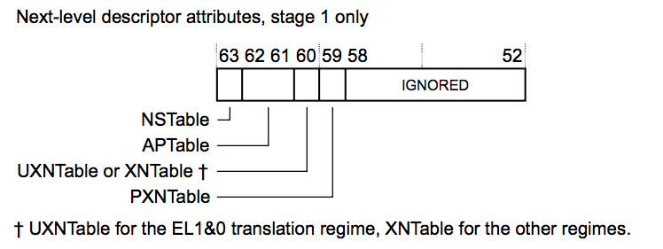
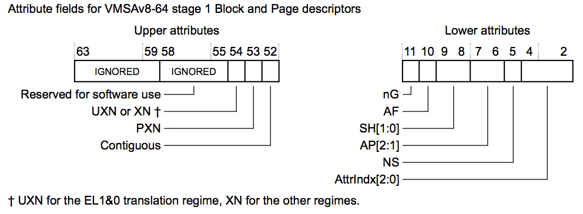

## D4.3.3 Memory attribute fields in the VMSAv8-64 translation table format descriptors

[Memory region attributes](#) 章节描述了 region 的属性信息。本小节后续内容将汇总 descriptor 的属性信息，包括：  

**Table descriptor**  
在 stage 2 translation 的 table descriptor 中没有包含属性信息。在 stage 1 translation 的 table descriptor 中包含 next lookup level 的属性信息，更多细节可以参考 [Next-level attributes in stage 1 VMSAv8-64 Table descriptors](#) 章节。

**Block and page descriptors**  
Block descriptor 和 Page descriptor 中包含 target block 和 page 的内存属性信息。这些属性信息在 Stage 1 和 stage 2 略有差别，具体细节参考以下章节：
* [Attribute fields in stage 1 VMSAv8-64 Block and Page descriptors](#)
* [Attribute fields in stage 2 VMSAv8-64 Block and Page descriptors](#)

### Next-level attributes in stage 1 VMSAv8-64 Table descriptors

在 stage 1 translation 的 Table descriptor 中，bits[63:59] 为 next-level translation table 的属性信息，bits[58:52] 则没有使用。

各个属性如下:

**NSTable, bit[63]**  
对于来自 Secure state 下的内存访问，该属性用于指示后续的 lookup 操作是处于 Secure state 还是 Non-secure state，更多细节参考 [Hierarchical control of Secure or Non-secure memory accesses](#) 章节。
对于来自 Non-secure state 下的内存访问， bit[63] 没有意义，此时该 bit 命名为 RES0，PE 在处理过程中会直接忽略此 bit。在 AArch64 EL2 translation regime 中，该 bit 命名为 RES1。

**APTable, bits[62:61]**  
该属性为后续 lookup 操作的访问权限控制位 (Access permissions)，更多细节参考 [Hierarchical control of data access permissions](#) 章节。
在以下两种场景中， APTable[0] 为 RES0：
* 在 EL2 translation regime 中. 
* 在 EL3 translation regime 中.

**UXNTable or XNTable, bit[60]**  
该属性定义了后续 lookup 操作的 XN 属性，更多细节参考 [Hierarchical control of instruction fetching](#) 章节。
在 EL1&0 translation regime 中，bit[60] 命名为 UXNTable，它确定了从 lower level lookup 所指向的 region 取出的指令是否可以在 EL0 上执行。在其他的 translation regimes 中，该 bit 命名为 XNTable。

**PXNTable, bit[59]**  
该属性定义了后续 lookup 操作的 PXN 属性，更多细节参考 [Hierarchical control of instruction fetching](#) 章节。
该 bit 在以下场景中没有使用：
* 在 EL2 translation regime 中。
* 在 EL3 translation regime 中。

被定义为 IGNORED 的比特位，在 PE 处理过程中会被忽略，不参与地址转换过程，更多信息可以参考 Glossary 章节中的 [IGNORED](#) 。 [Other fields in the VMSAv8-64 translation table format descriptors](#) 章节则介绍了除上述属性外的其他比特位的详细信息。

### Attribute fields in stage 1 VMSAv8-64 Block and Page descriptors

Stage 1 translation 中的 Block 和 Page descriptor 的内存属性由 upper block 和 lower block 两部分组成，如下图所示：

在 Stage 1 descriptor, 各个属性的定义如下:

**UXN or XN, bit[54]**  
该 bit 为 Execute-never，决定了 descriptor 所指向的 region 是否 executable，更多信息参考 [Access permissions for instruction execution](#) 章节。 
在 EL1&0 translation regime 中，该 bit 为 UXN (Unprivileged execute never)，确定了从 descriptor 所指向的 region 取出的指令是否可以在 EL0 上执行。在其他的 translation regimes 中，该 bit 命名为 XN (Execute never)。

**PXN, bit[53]**  
该 bit 为 Privileged execute-never，决定了 descriptor 所指向的 region 在 EL1 中是否 executable，更多信息参考 [Access permissions for instruction execution](#) 章节。 
在 EL2 和 EL3 translation regimes 中，该 bit 为 RES0。

**Contiguous, bit[52]**  
该 bit 用于指示 translation table entry 是否属于 contiguous set or entries。contiguous set or entries cache 到 TLB 中时只占用一个 entry，更多信息参考 [The Contiguous bit](#) 章节。

**nG, bit[11]**  
该 bit 为 not global，当 entry 被加载到 TLB 时，该 bit 用于指示 TLB entry 是属于当前 ASID 还是属于所有的 ASID，更多细节可以参考 [Global and process-specific translation table entries](#) 章节。
该 bit 只在 EL1&0 translation regime 中有效，在其他 regimes 中为 RES0。

**AF, bit[10]**  
该 bit 为 Access flag，更多细节参考 [Access flag](#) 章节。

**SH, bits[9:8]**  
Shareability field, see Memory region attributes on page D4-1712. 
该 bit 为 Shareability field，更多细节参考 [Memory region attributes](#) 章节。

**AP[2:1], bits[7:6]**  
该 bit 为 Data Access Permissions，更多细节参考 [Memory access control](#) 章节。
> **NOTE:**  
在 ARMv8 中，translation table descriptor 格式定义了 AP[2:1] 作为 Access Permission，AP[0] 没有被使用。

AP[1] 只在 EL1&0 translation regime 有效，在其他 regimes 中，该 bit 为 RES1。

**NS, bit[5]**  
Non-secure bit. For memory accesses from Secure state, specifies whether the output address is in the Secure or Non-secure address map, see [Control of Secure or Non-secure memory access on page D4-1702](#).  
For memory accesses from Non-secure state, this bit is RES0 and is ignored by the PE. This field is RES1 in the AArch64 EL2 translation regime.
该 bit 为 Non-secure，用于指示在 Secure state 下发起的内存访问的 translation 的 output address 指向 Secure world 还是 Non-secure world，更多细节参考 [Control of Secure or Non-secure memory access](#) 章节。
对于在 Non-secure state 下发起的内存访问中，该 bit 为 RES0，PE 不对其做处理。在 AArch64 EL2 translation regime 中，该 bit 为 RES1。

**AttrIndx[2:0], bits[4:2]**  
Stage 1 memory attributes index field, for the MAIR_ELx, see [Memory region type and attributes, for stage 1 translations on page D4-1712](#).
该 bit 为 Stage 1 memory attributes index，即 MAIR_ELx，更多细节参考 

The definition of IGNORED means the architecture guarantees that the PE makes no use of the field, see [IGNORED on page Glossary-5886](#). For more information about these fields see [Other fields in the VMSAv8-64 translation table format descriptors on page D4-1715](#).

### Attribute fields in stage 2 VMSAv8-64 Block and Page descriptors

In Block and Page descriptors, the memory attributes are split into an upper block and a lower block, as shown for a stage 2 translation:

For a stage 2 descriptor, the attributes are:

**XN, bit[54]**  
The Execute-never bit. Determines whether the region is executable, see [Access permissions for
instruction execution on page D4-1707](#). 

**Contiguous, bit[52]**  
A hint bit indicating that the translation table entry is one of a contiguous set or entries, that might be cached in a single TLB entry, see [The Contiguous bit on page D4-1715.](#)

**AF, bit[10]**  
The Access flag, see [The Access flag on page D4-1711](#).

**SH, bits[9:8]**  
Shareability field, see [The memory region attributes for stage 2 translations, EL1&0 translation regime on page D4-1713](#). 

**S2AP, bits[7:6]**  
Stage 2 data Access Permissions bits, see [The S2AP data access permissions, Non-secure EL1&0 translation regime on page D4-1706](#).
> **NOTE:**
> In the original VMSAv7-32 Long-descriptor attribute definition, this field was called HAP[2:1], for consistency with the AP[2:1] field in the stage 1 descriptors and despite there being no HAP[0] bit. ARMv8 renames the field for greater clarity.

**MemAttr, bits[5:2]**
Stage 2 memory attributes, see [The memory region attributes for stage 2 translations, EL1&0 translation regime on page D4-1713](#).

The definition of IGNORED means the architecture guarantees that the PE makes no use of the field, see IGNORED on page Glossary-5886. For more information about these fields see [Other fields in the VMSAv8-64 translation table format descriptors on page D4-1715](#).
